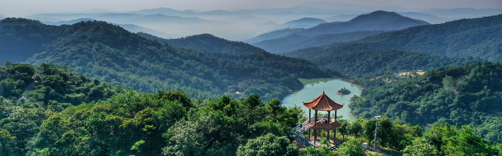

# 广州市白江湖森林公园景区

## 景点图片

## 基本信息

| 项目 | 内容 |
|------|------|
| 景点名称 | 广州市白江湖森林公园景区 |
| 所在城市 | 广州市 |
| 所在区县 | 增城区 |
| 景点级别 | 3A级景区 |
| 景点类型 | 森林公园 |
| 开放时间 | 5月至10月08:30-18:30；11月至次年4月09:00-18:00 |
| 门票价格 | 以公园官方购票页面和现场公告为准 |

## 景点介绍

广州市白江湖森林公园景区位于增城区正果镇，公园规划面积约2.47万亩，当前开放面积约1.1万亩，森林覆盖率约96%。园内最高峰神山海拔684米，拥有森林、溪谷、瀑布和珍稀动植物资源，是广州东部重要的森林生态游憩空间。

公园以溯溪体验为特色，主要景观包括白江湖、天然浴缸、水嗡飞瀑、神牛广场及禾雀花等。山区开放区域会受天气、防火和水情影响，出发前应查看公园公告并遵守现场安全管理要求。

## 景点特点

- **高森林覆盖率**：开放区域森林覆盖率约96%
- **溪谷瀑布景观**：以溯溪和山水游览为主要特色
- **神山主峰**：最高处海拔684米
- **生态资源丰富**：拥有多种动植物和季节性禾雀花景观

## 位置

- **地址**：广州市增城区正果镇浪拔村
- **经纬度**：23.4977°N, 113.9084°E

## 交通

- **公共交通**：先到增城区正果镇，再转乘当地交通前往公园
- **自驾**：导航至广州市白江湖森林公园，山区道路请谨慎驾驶

## 数据来源

- [广州市白江湖森林公园官方网站](http://www.baijianghu.com.cn/)
- [广州市白江湖森林公园：游客须知](http://www.baijianghu.com.cn/park_service_show.aspx?id=6)
- 图片来源：广州市白江湖森林公园官方网站

## 最后更新时间

2026-07-14
