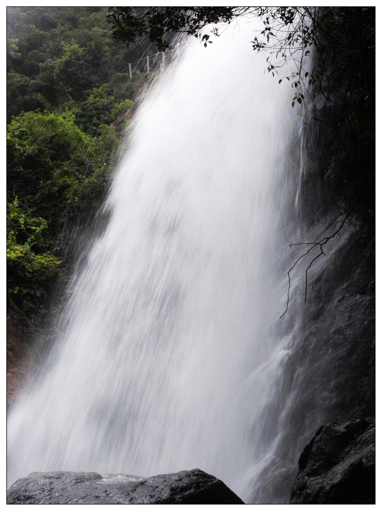

# 白水寨

## 景点图片

> 图片来源：[Wikimedia Commons](https://commons.wikimedia.org/wiki/File%3A%E5%A2%9E%E5%9F%8E%E7%99%BD%E6%B0%B4%E5%AF%A8%E7%80%91%E5%B8%83%20-%20panoramio.jpg) · 许可证：CC BY-SA 4.0

## 基本信息

| 项目 | 内容 |
|------|------|
| 景点名称 | 白水寨风景名胜区 |
| 所在城市 | 广州市 |
| 所在区县 | 增城区 |
| 景点级别 | 4A级景区 |
| 景点类型 | 自然风景区 |
| 开放时间 | 08:30-17:30 |
| 门票价格 | 约60元/人 |

## 景点介绍

白水寨风景名胜区位于广州市增城区派潭镇，是国家AAAA级旅游景区。景区以落差达428.5米的白水仙瀑为核心景观，这是中国大陆落差最大的瀑布之一。景区内拥有原始森林、浅滩湿地、天南第一梯（9999级登山步道）等自然景观，被誉为"北回归线上的瑰丽翡翠"。

白水仙瀑从山顶飞流直下，气势磅礴，尤其在雨季更为壮观。天南第一梯是景区最著名的登山步道，共有9999级台阶，沿途可近距离欣赏瀑布和溪流。景区内还有亲水栈道、大封门森林公园等景点。

白水寨是广州市民周末登山健身和亲近自然的热门去处，也是珠三角地区最具代表性的瀑布景观之一。

## 景点特点

- **白水仙瀑**：落差428.5米，中国大陆落差最大的瀑布之一
- **天南第一梯**：9999级台阶登山步道
- **"北回归线上的瑰丽翡翠"**：原始森林、浅滩湿地
- **亲水栈道**：沿瀑布溪流而建
- **大封门森林公园**：原始森林氧吧

## 位置

- **地址**：广州市增城区派潭镇白水寨风景名胜区
- **经纬度**：23.4167°N, 113.7500°E

## 交通

- **自驾**：广州市区出发约1.5-2小时车程
- **公交**：增城区有旅游专线可达

## 数据来源

- [百度百科-白水寨](https://baike.baidu.com/item/白水寨)

## 最后更新时间

2026-06-28
