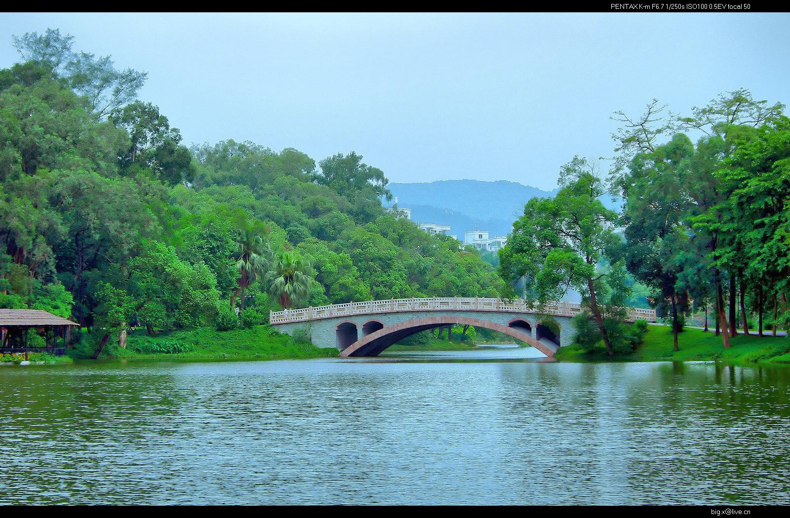

# 华南国家植物园

## 景点图片

> 图片来源：[Wikimedia Commons](https://commons.wikimedia.org/wiki/File%3ASouth%20China%20Botanical%20Garden%202009%201.jpg) · 许可证：CC BY-SA 4.0

## 基本信息

| 项目 | 内容 |
|------|------|
| 景点名称 | 华南国家植物园 |
| 所在城市 | 广州市 |
| 所在区县 | 天河区 |
| 景点级别 | 5A级景区 |
| 景点类型 | 植物园 |
| 开放时间 | 07:30-17:30 |
| 门票价格 | 20元/人 |

## 景点介绍

华南国家植物园位于广州市天河区，是中国最大的南亚热带植物园，也是国家AAAAA级旅游景区。植物园占地面积约333公顷，拥有各种植物13000多种，是集植物科研、科普教育和旅游观光于一体的综合性植物园。

华南国家植物园分为温室群景区、木兰园、棕榈园、姜园、兰园、药用植物园等多个专类园区。温室群景区是植物园的核心景点，包括热带雨林室、沙漠植物室、高山植物室等，展示了来自世界各地的珍稀植物。

华南国家植物园是广州市最大的植物科研和科普教育基地，也是广州市民休闲观光的热门去处。

## 景点特点

- **中国最大的南亚热带植物园**：占地面积约333公顷
- **13000多种植物**：来自世界各地的珍稀植物
- **5A级景区**：国家AAAAA级旅游景区
- **温室群景区**：热带雨林室、沙漠植物室等
- **专类园区**：木兰园、棕榈园、兰园等

## 位置

- **地址**：广州市天河区天源路1190号
- **经纬度**：23.1833°N, 113.3500°E

## 交通

- **地铁**：6号线植物园站
- **公交**：多路公交至植物园站
- **自驾**：可停放至植物园停车场

## 数据来源

- [华南国家植物园官方网站](http://www.scb.ac.cn/)
- [百度百科-华南国家植物园](https://baike.baidu.com/item/华南国家植物园)

## 最后更新时间

2026-06-20
