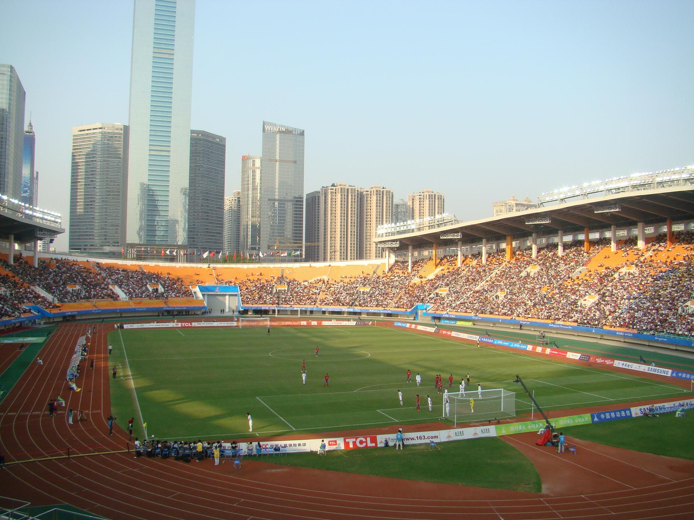

# 天河体育中心

## 景点图片

> 图片来源：[Wikimedia Commons](https://commons.wikimedia.org/wiki/File%3ATianhe%20Stadium.jpg) · 许可证：CC BY-SA 4.0

## 基本信息

| 项目 | 内容 |
|------|------|
| 景点名称 | 天河体育中心 |
| 所在城市 | 广州市 |
| 所在区县 | 天河区 |
| 景点级别 | 无 |
| 景点类型 | 体育场馆 |
| 开放时间 | 06:00-22:00 |
| 门票价格 | 免费（部分场馆收费） |

## 景点介绍

天河体育中心位于广州市天河区，是广州市最大的体育场馆群，也是广州市标志性的体育建筑之一。天河体育中心始建于1987年，是第六届全国运动会的主会场。

天河体育中心占地面积约58万平方米，由体育场、体育馆、游泳馆、网球场等多个场馆组成。体育场可容纳约6万名观众，是广州市举办大型体育赛事和文艺演出的主要场所。

天河体育中心周边还有天河城、正佳广场等大型商业综合体，是广州市民休闲娱乐的热门区域。

## 景点特点

- **广州市最大的体育场馆群**：占地面积约58万平方米
- **第六届全国运动会主会场**：历史悠久
- **多个场馆**：体育场、体育馆、游泳馆等
- **商业综合体**：周边有天河城、正佳广场等
- **免费开放**：部分场馆免费

## 位置

- **地址**：广州市天河区天河路333号
- **经纬度**：23.1372°N, 113.3239°E

## 交通

- **地铁**：1号线/3号线体育西路站
- **公交**：多路公交至体育中心站
- **自驾**：可停放至体育中心停车场

## 数据来源

- [百度百科-天河体育中心](https://baike.baidu.com/item/天河体育中心)

## 最后更新时间

2026-06-20
