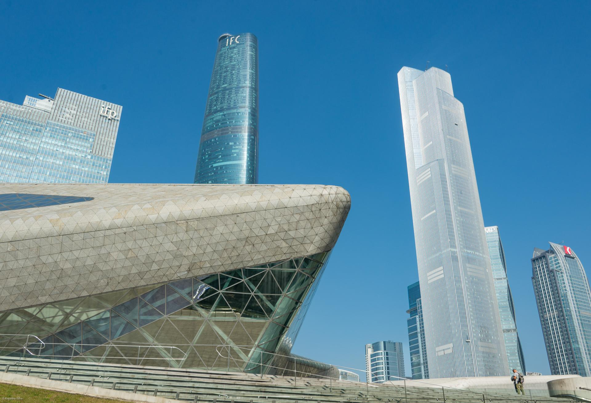

# 广州大剧院

## 景点图片

> 图片来源：[Wikimedia Commons](https://commons.wikimedia.org/wiki/File:Guangzhou_Opera_House.jpg) · 许可证：CC BY-SA 4.0

## 基本信息

| 项目 | 内容 |
|------|------|
| 景点名称 | 广州大剧院 |
| 所在城市 | 广州市 |
| 所在区县 | 天河区 |
| 景点级别 | 无 |
| 景点类型 | 文化场馆 |
| 开放时间 | 周二至周日：10:00-17:00（周一闭馆） |
| 门票价格 | 参观免费（演出另购） |

## 景点介绍

广州大剧院位于广州市天河区珠江新城珠江西路1号，是广州市标志性的文化建筑之一，由已故著名建筑师扎哈·哈迪德（Zaha Hadid）设计。建筑外形如同两块被珠江水冲刷过的"砾石"，造型独特，极具现代感。

广州大剧院于2010年正式启用，是广州亚运会的重要配套设施之一。剧院拥有大剧场（约1800座）和多功能剧场（约400座），可举办歌剧、芭蕾、交响乐、话剧等多种演出。

广州大剧院是广州市最重要的文化演出场所之一，也是广州市民欣赏高雅艺术的重要去处。剧院周边还有广东省博物馆、广州图书馆等文化设施，共同构成了珠江新城的文化核心区。

## 景点特点

- **扎哈·哈迪德设计**：著名建筑师设计的现代建筑
- **"砾石"造型**：外形如同两块被珠江水冲刷过的砾石
- **大剧场**：约1800座，可举办各类演出
- **文化地标**：广州市标志性的文化建筑
- **珠江新城核心**：与广东省博物馆、广州图书馆相邻

## 位置

- **地址**：广州市天河区珠江西路1号
- **经纬度**：23.1174°N, 113.3190°E

## 交通

- **地铁**：APM线大剧院站、3号线/5号线珠江新城站
- **公交**：多路公交至大剧院站
- **自驾**：可停放至大剧院停车场

## 数据来源

- [广州大剧院官方网站](http://www.gzdjy.com/)
- [百度百科-广州大剧院](https://baike.baidu.com/item/广州大剧院)

## 最后更新时间

2026-06-20
