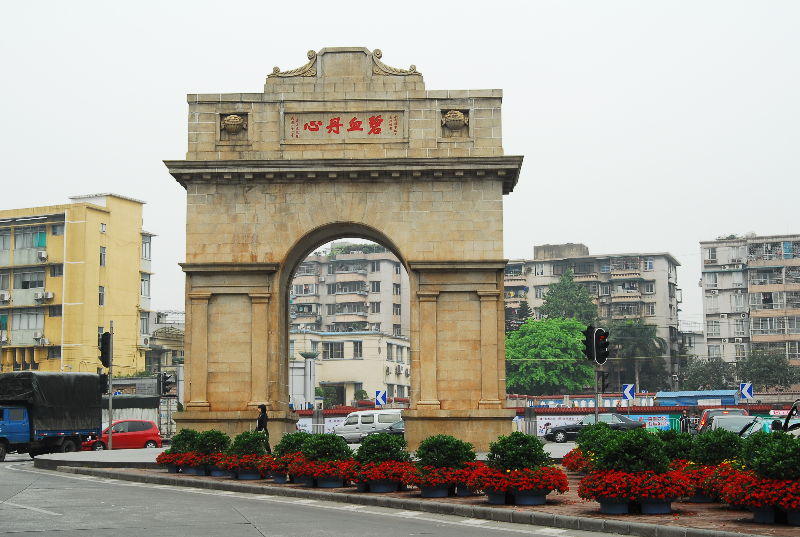

# 广州市十九路军淞沪抗日阵亡将士陵园

## 景点图片

## 基本信息

| 项目 | 内容 |
|------|------|
| 景点名称 | 广州市十九路军淞沪抗日阵亡将士陵园 |
| 所在城市 | 广州市 |
| 所在区县 | 天河区 |
| 景点级别 | 3A级景区 |
| 景点类型 | 抗战纪念设施、纪念性公园 |
| 开放时间 | 以陵园管理中心最新公告为准 |
| 门票价格 | 免费 |

## 景点介绍

广州市十九路军淞沪抗日阵亡将士陵园位于水荫路113号，是为纪念国民革命军第十九路军在1932年“一·二八”淞沪抗战中阵亡的将士而建。陵园由十九路军主要将领发起筹建，建筑师杨锡宗设计并监造，1933年建成，主体建筑以花岗石砌筑，具有古罗马式建筑特色。

陵园占地约6万平方米，由北向南分布凯旋门、先烈纪念碑、题名碑、抗日亭、将军墓、将士墓、战士墓、先烈纪念馆和展览馆等。这里是首批国家级抗战纪念设施、遗址，国家级重点烈士纪念设施和全国爱国主义教育示范基地。

## 景点特点

- **一·二八淞沪抗战纪念地**：纪念十九路军阵亡将士
- **1933年建成**：由建筑师杨锡宗设计并监造
- **完整纪念建筑序列**：包括凯旋门、纪念碑、墓园和纪念馆
- **国家级纪念设施**：兼具烈士纪念、文物保护和爱国主义教育功能

## 位置

- **地址**：广州市天河区水荫路113号
- **经纬度**：23.1450°N, 113.3098°E

## 交通

- **地铁**：6号线沙河顶站，出站后步行或转乘公交
- **公交**：乘坐途经十九路军陵园站或水荫路一带的公交线路

## 数据来源

- [广州市人民政府：广州市十九路军淞沪抗日阵亡将士陵园](https://www.gz.gov.cn/zlgz/gzly/wzgz/agjyjd/content/post_9618844.html)
- [广州市文化广电旅游局：2025年度国家3A级旅游景区质量等级复核结果](https://wglj.gz.gov.cn/xxgk/gzdt/tzgsgg/content/post_10480870.html)
- 图片来源：广州市人民政府

## 最后更新时间

2026-07-14
