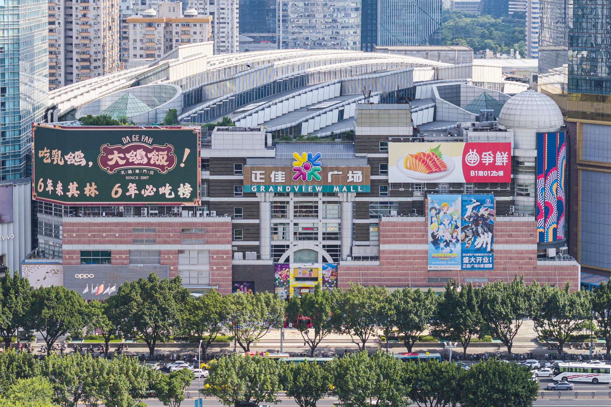

# 正佳广场商贸旅游区

## 景点图片

> 图片拍摄于 2025-08-23。来源：[Wikimedia Commons](https://commons.wikimedia.org/wiki/File:Grandview_Mall_20250823.jpg) · 作者：Tim Wu · 许可证：[CC BY-SA 4.0](https://creativecommons.org/licenses/by-sa/4.0/)

## 基本信息

| 项目 | 内容 |
|------|------|
| 景点名称 | 正佳广场商贸旅游区 |
| 所在城市 | 广州市 |
| 所在区县 | 天河区 |
| 景点级别 | 4A级景区 |
| 景点类型 | 商贸旅游、文化娱乐综合体 |
| 开放时间 | 各场馆及商户开放时间不同，以官方公告为准 |
| 门票价格 | 公共区域开放，内部收费场馆另行购票 |

## 景点介绍

正佳广场商贸旅游区位于天河路商圈，以大型商业空间为基础，集合海洋馆、自然科学博物馆、剧场、餐饮和零售等多种文旅业态。现有“正佳极地海洋世界”页面为其中的独立场馆，本页记录官方A级名录中的整体旅游区。

## 景点特点

- **多场馆组合**：商业空间内集中分布文化、科普及娱乐设施
- **城市商贸旅游**：购物、餐饮和旅游体验相互融合
- **交通便利**：位于天河路核心商圈，邻近多条地铁线路

## 位置

- **地址**：广州市天河区天河路228号

## 交通

- **地铁**：可乘广州地铁1号线至体育中心站，或3号线至石牌桥站
- **公交**：可乘公交至天河路商圈周边站点

## 数据来源

- [广州市文化广电旅游局：广州市A级景区名录](http://wglj.gz.gov.cn/ggfw/lyl/lydwcx/content/post_10878689.html)

## 最后更新时间

2026-07-15
