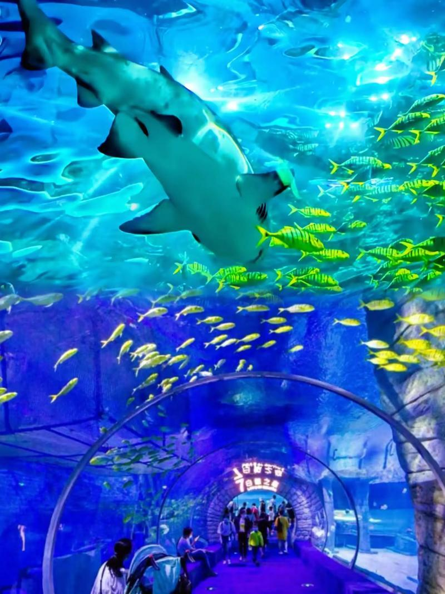

# 正佳极地海洋世界

## 景点图片

## 基本信息

| 项目 | 内容 |
|------|------|
| 景点名称 | 正佳极地海洋世界 |
| 所在城市 | 广州市 |
| 所在区县 | 天河区 |
| 景点级别 | 无 |
| 景点类型 | 海洋主题乐园 |
| 开放时间 | 10:00-21:00 |
| 门票价格 | 约220元/人 |

## 景点介绍

正佳极地海洋世界位于广州市天河区正佳广场内，是广州市中心唯一的室内极地海洋主题乐园。项目面积约5.3万平方米，拥有超过300种、约3万只海洋生物，是集海洋生物展示、极地动物表演、互动体验于一体的综合性海洋主题乐园。

正佳极地海洋世界设有十大主题展区，包括极地冰川、深海奇观、热带雨林、水母秘境等。游客可以近距离观赏白鲸、企鹅、北极熊、海豚等极地和海洋动物。园内还有精彩的海豚表演、美人鱼表演等节目。

正佳极地海洋世界位于天河路商圈核心地段，交通便利，是广州市民和游客亲子游的热门去处，也是雨天和酷暑天气下的理想室内游玩场所。

## 景点特点

- **市中心海洋乐园**：广州市中心唯一的室内极地海洋主题乐园
- **十大主题展区**：极地冰川、深海奇观、热带雨林、水母秘境等
- **300多种海洋生物**：白鲸、企鹅、北极熊、海豚等
- **精彩表演**：海豚表演、美人鱼表演等
- **亲子首选**：适合家庭亲子游

## 位置

- **地址**：广州市天河区天河路228号正佳广场内
- **经纬度**：23.1331°N, 113.3278°E

## 交通

- **地铁**：1号线体育中心站、3号线体育西路站
- **公交**：多路公交至体育中心站
- **自驾**：可停放至正佳广场停车场

## 数据来源

- [正佳极地海洋世界官方网站](http://www.oceanexplorium.com/)
- [百度百科-正佳极地海洋世界](https://baike.baidu.com/item/正佳极地海洋世界)

## 最后更新时间

2026-06-20
