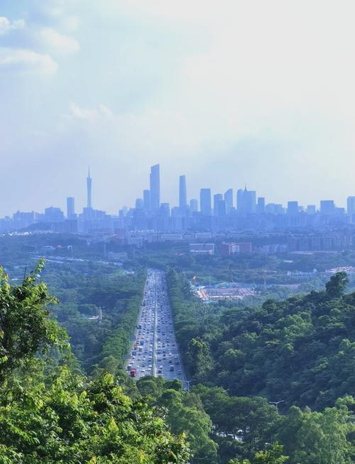

# 火炉山森林公园

## 景点图片

## 基本信息

| 项目 | 内容 |
|------|------|
| 景点名称 | 火炉山森林公园 |
| 所在城市 | 广州市 |
| 所在区县 | 天河区 |
| 景点级别 | - |
| 景点类型 | 森林公园 |
| 开放时间 | 全天开放 |
| 门票价格 | 免费 |

## 景点介绍

火炉山森林公园位于广州市天河区岑村，占地约410公顷，是广州市区内的大型森林公园。因山体形状似火炉而得名，主峰海拔约322米，是广州市区内的制高点之一。

火炉山以原始次生林和丰富的植物景观为特色，森林覆盖率高达95%以上。园内设有多条登山步道，沿途绿树成荫，空气清新。山顶设有观景平台，可俯瞰广州城区全景。

火炉山是广州市民周末登山健身的热门去处，也是广州马拉松等大型体育赛事的训练基地。公园内设有烧烤场、野餐区等设施，是家庭出游的好去处。

## 景点特点

- **市区大型森林公园**：占地约410公顷
- **原始次生林**：森林覆盖率95%以上
- **登山健身**：多条登山步道
- **城市制高点**：主峰海拔322米，可俯瞰城区
- **免费开放**：市民休闲的好去处
- **烧烤野餐**：设有烧烤场和野餐区

## 位置

- **地址**：广州市天河区岑村火炉山森林公园
- **经纬度**：23.1667°N, 113.3833°E

## 交通

- **地铁**：3号线天河客运站，转乘公交
- **公交**：78路、B11路至火炉山森林公园站
- **自驾**：可停放至公园停车场

## 数据来源

- [百度百科-火炉山森林公园](https://baike.baidu.com/item/火炉山森林公园)

## 最后更新时间

2026-06-25
