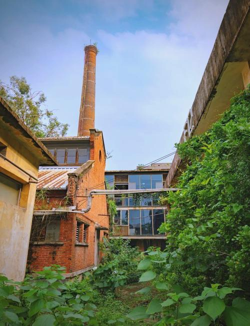

# 红专厂创意艺术区

## 景点图片

## 基本信息

| 项目 | 内容 |
|------|------|
| 景点名称 | 红专厂创意艺术区 |
| 所在城市 | 广州市 |
| 所在区县 | 天河区 |
| 景点级别 | - |
| 景点类型 | 文创园区 |
| 开放时间 | 已关闭（原10:00-21:00） |
| 门票价格 | 已关闭（原免费） |

## 景点介绍

红专厂创意艺术区（Redtory）位于广州市天河区员村四横路128号，是由原广州鹰金钱食品厂（建于1956年）旧厂房改造而成的创意产业园区。园区占地约17万平方米，曾是广州最具代表性的文创园区之一。

红专厂保留了大量工业时代的红砖厂房建筑，将旧工业遗产与现代艺术创意相结合。园区内曾设有多个艺术画廊、设计工作室、创意商店、特色餐厅和咖啡馆，定期举办各类艺术展览、文化活动和创意市集。

红专厂以其独特的工业美学氛围和浓厚的艺术气息，曾吸引了众多艺术家、设计师和文艺青年，是广州文艺打卡的热门目的地，也是摄影爱好者的天堂。**红专厂于2019年关闭清拆**，原址土地已重新规划开发，目前已不再作为文创园区运营。

## 景点特点

- **工业遗产活化**：由1956年食品厂改造
- **红砖厂房美学**：保留大量工业时代建筑
- **艺术展览**：曾定期举办各类当代艺术展
- **创意市集**：曾设有周末创意集市
- **文艺打卡地**：曾是广州最具代表性的文创园区
- **已关闭**：2019年关闭清拆，原址重新规划开发

## 位置

- **地址**：广州市天河区员村四横路128号
- **经纬度**：23.0541°N, 113.3616°E

## 交通

- **地铁**：5号线员村站B出口，步行约10分钟
- **公交**：40路、44路、293路等至员村站
- **自驾**：可停放至园区停车场

## 数据来源

- [百度百科-红专厂](https://baike.baidu.com/item/红专厂)

## 最后更新时间

2026-06-28
