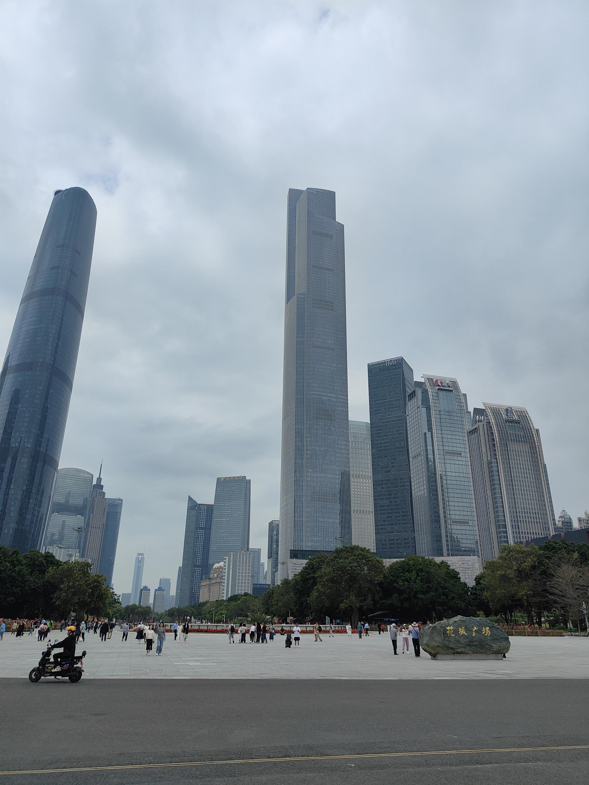

# 花城广场

## 景点图片

> 图片来源：[Wikimedia Commons](https://commons.wikimedia.org/wiki/File%3A%E8%8A%B1%E5%9F%8E%E5%B9%BF%E5%9C%BA.jpg) · 许可证：CC BY-SA 4.0

## 基本信息

| 项目 | 内容 |
|------|------|
| 景点名称 | 花城广场 |
| 所在城市 | 广州市 |
| 所在区县 | 天河区 |
| 景点级别 | 无 |
| 景点类型 | 城市广场/市民公园 |
| 开放时间 | 全天开放 |
| 门票价格 | 免费 |

## 景点介绍

花城广场位于广州市天河区珠江新城，是广州最大的城市中心广场，总面积约56万平方米，被誉为广州的"城市客厅"。广场位于广州新中轴线上，是广州城市新地标之一。

花城广场周边汇聚了众多标志性建筑，包括广东省博物馆、广州大剧院、广州市图书馆、广州市第二少年宫、广州国际金融中心（西塔）和东塔等。广场内有大型音乐喷泉、人工湖、绿化景观带等设施，是广州市民休闲娱乐和游客观光的热门去处。

每到夜晚，花城广场灯光璀璨，音乐喷泉随着音乐节奏变幻，与周边高楼大厦的灯光交相辉映，构成一幅壮观的城市夜景。花城广场也是广州举办各种大型活动和庆典的重要场所。

## 景点特点

- **广州"城市客厅"**：广州最大的城市中心广场，总面积约56万平方米
- **新中轴线核心**：位于广州新中轴线上
- **标志性建筑群**：周边有广东省博物馆、广州大剧院、西塔、东塔等
- **音乐喷泉**：大型音乐喷泉表演
- **城市夜景**：灯光璀璨，是广州最美的夜景之一

## 位置

- **地址**：广州市天河区花城大道
- **经纬度**：23.1174°N, 113.3190°E

## 交通

- **地铁**：3号线/5号线珠江新城站、APM线花城大道站
- **公交**：多路公交可达
- **自驾**：可停放至花城汇停车场

## 数据来源

- [百度百科-花城广场](https://baike.baidu.com/item/花城广场)

## 最后更新时间

2026-06-20
