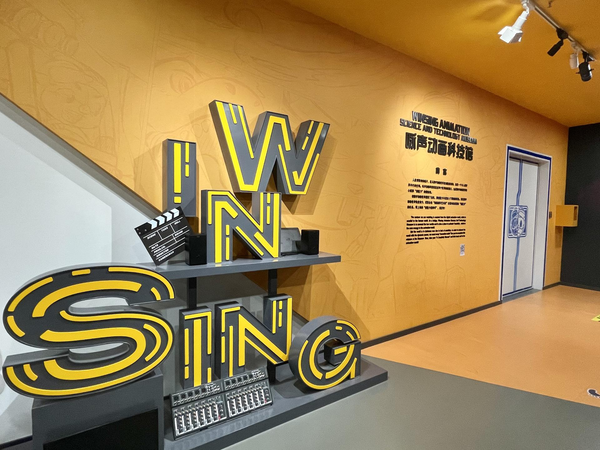

# 广州市咏声动画科技馆旅游区

## 景点图片

## 基本信息

| 项目 | 内容 |
|------|------|
| 景点名称 | 广州市咏声动画科技馆旅游区 |
| 所在城市 | 广州市 |
| 所在区县 | 海珠区 |
| 景点级别 | 3A级景区 |
| 景点类型 | 动画科技馆 |
| 开放时间 | 以场馆公布的预约场次和活动通知为准 |
| 门票价格 | 以场馆预约活动公告为准 |

## 景点介绍

广州市咏声动画科技馆旅游区位于海珠区南华东路草芳围，是咏声文旅运营的动画主题展馆，也是广州市科普资源单位。场馆面向全年龄游客，将数字文化展示、动画创作体验、艺术活动和主题亲子游乐结合在一起。

场馆设有动画文化区、创作现场、大剧场、艺术区、主题游乐区、动画驿站和灵感花园七大区域。“创作现场”按照策划、故事板、角色与场景设计、建模、动画、灯光、渲染、特效、剪辑和声音设计等阶段展示数字动画制作流程，并配置费纳奇镜、走马灯、翻书动画及多媒体互动装置。

## 景点特点

- **七大主题区域**：覆盖展示、创作、艺术和亲子体验
- **完整动画流程**：从前期策划展示至后期合成与声音设计
- **互动科普装置**：通过视觉暂留和数字互动讲解动画原理
- **动漫IP体验**：融入猪猪侠等咏声动漫IP内容

## 位置

- **地址**：广州市海珠区南华东路草芳围2-1号
- **经纬度**：23.1111°N, 113.2730°E

## 交通

- **地铁**：2号线市二宫站A或B出口
- **公交**：草芳围站可乘8路、16路、121路、121A路、131A路、131B路或B21路
- **水上巴士**：纺织码头下船后步行前往

## 数据来源

- [广州市科学技术协会科普资源单位：咏声动画科技馆](https://bm.kepugz.cn/portal/com/250.html)
- [广州市文化广电旅游局：2025年度国家3A级旅游景区质量等级复核结果](https://wglj.gz.gov.cn/xxgk/gzdt/tzgsgg/content/post_10480870.html)
- 图片来源：广州市科学技术协会科普资源单位平台

## 最后更新时间

2026-07-14
