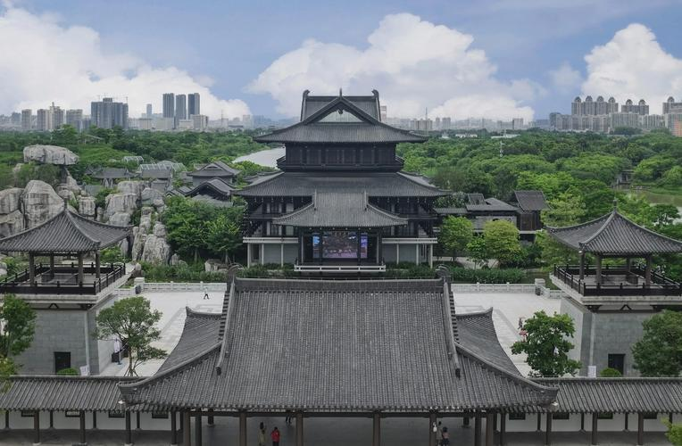
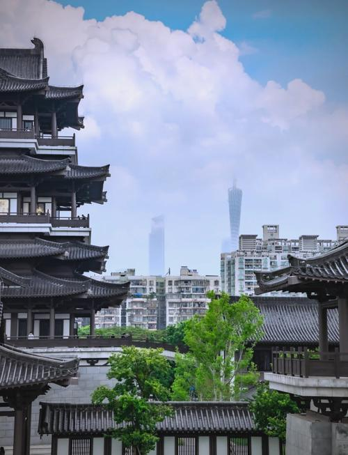

# 广州市文化馆

## 景点图片

## 基本信息

| 项目 | 内容 |
|------|------|
| 景点名称 | 广州市文化馆 |
| 所在城市 | 广州市 |
| 所在区县 | 海珠区 |
| 景点级别 | - |
| 景点类型 | 文化场馆 |
| 开放时间 | 09:00-17:00（周一闭馆） |
| 门票价格 | 免费 |

## 景点介绍

广州市文化馆（新馆）位于广州市海珠区新滘中路288号，于2023年2月正式对公众开放，是目前全国最大的文化馆之一。项目总建筑面积约5.4万平方米，占地面积约14.2万平方米。

新馆以"十里红云一湾水，八桥画舫十六亭"为设计理念，建筑群采用岭南园林风格，由公共文化中心、翰墨园、曲艺园、广府园、广绣园等多个主题园区组成，各园区之间以水系和连廊相连接。

广州市文化馆集公益演出、培训、展览、创作、交流于一体，设有小剧场、排练厅、培训室、展览厅等多种功能空间，是广州市重要的公共文化服务设施和群众文化活动中心。

## 景点特点

- **全国最大文化馆之一**：建筑面积约5.4万平方米
- **岭南园林风格**：八桥画舫十六亭，建筑精美
- **五大主题园区**：公共文化中心、翰墨园、曲艺园、广府园、广绣园
- **免费开放**：公众可免费入馆参观
- **公共文化服务**：集演出、培训、展览于一体

## 位置

- **地址**：广州市海珠区新滘中路288号
- **经纬度**：23.0787°N, 113.3218°E

## 交通

- **地铁**：3号线大塘站B出口，步行约10分钟
- **公交**：264路、761路等至文化馆站
- **自驾**：可停放至地下停车场

## 数据来源

- [广州市文化馆官方网站](https://www.gzwhg.com/)

## 最后更新时间

2026-06-25
