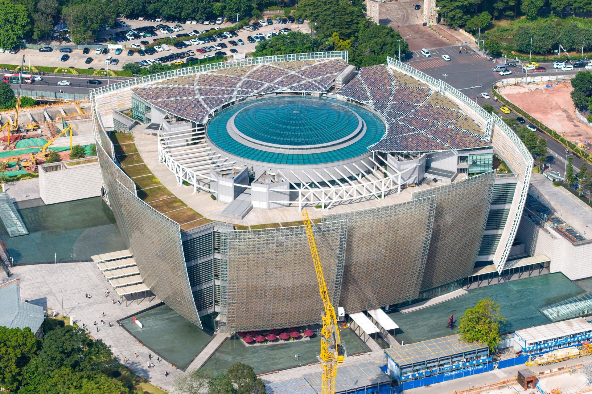

# 广州艺术博物院（广州美术馆）

## 景点图片

## 基本信息

| 项目 | 内容 |
|------|------|
| 景点名称 | 广州艺术博物院（广州美术馆） |
| 所在城市 | 广州市 |
| 所在区县 | 海珠区 |
| 景点级别 | 国家重点美术馆 |
| 景点类型 | 艺术馆 |
| 开放时间 | 09:00-17:00（周二至周日，周一闭馆） |
| 门票价格 | 免费 |

## 景点介绍

广州艺术博物院（广州美术馆）位于海珠区艺洲路198号，是国家重点美术馆，也是华南地区最大的艺术博物馆之一。博物院于2023年迁至海珠区广州塔旁新馆，建筑面积约8万平方米，是集收藏、展览、研究、教育于一体的现代化艺术殿堂。原麓湖旧馆（越秀区麓湖路13号）曾使用"广州艺术博物院"名称，现统一为"广州艺术博物院（广州美术馆）"。

馆藏以中国近现代书画为特色，尤以岭南画派作品最为丰富，收藏有高剑父、高奇峰、陈树人、关山月、黎雄才等岭南画派大师的代表作。此外，还收藏有宋元明清各代的书画精品。

注：广州艺术博物院又称广州美术馆，原址位于越秀区麓湖，现址位于海珠区广州塔旁。

## 景点特点

- **国家重点美术馆**：华南地区最大的艺术博物馆之一
- **岭南画派收藏**：收藏大量岭南画派大师作品
- **历代书画**：馆藏宋元明清各代书画精品
- **建筑艺术**：现代化的博物馆建筑设计
- **临时展览**：定期举办各类艺术特展

## 位置

- **地址**：广州市海珠区艺洲路198号
- **经纬度**：23.1026°N, 113.3235°E

## 交通

- **地铁**：3号线/APM线广州塔站，步行约15分钟
- **公交**：121路、204路、262路等至广州艺博院站
- **自驾**：可停放在博物院停车场

## 数据来源

- [广州艺术博物院官方网站](http://www.gzam.com.cn/)

## 最后更新时间

2026-06-20
