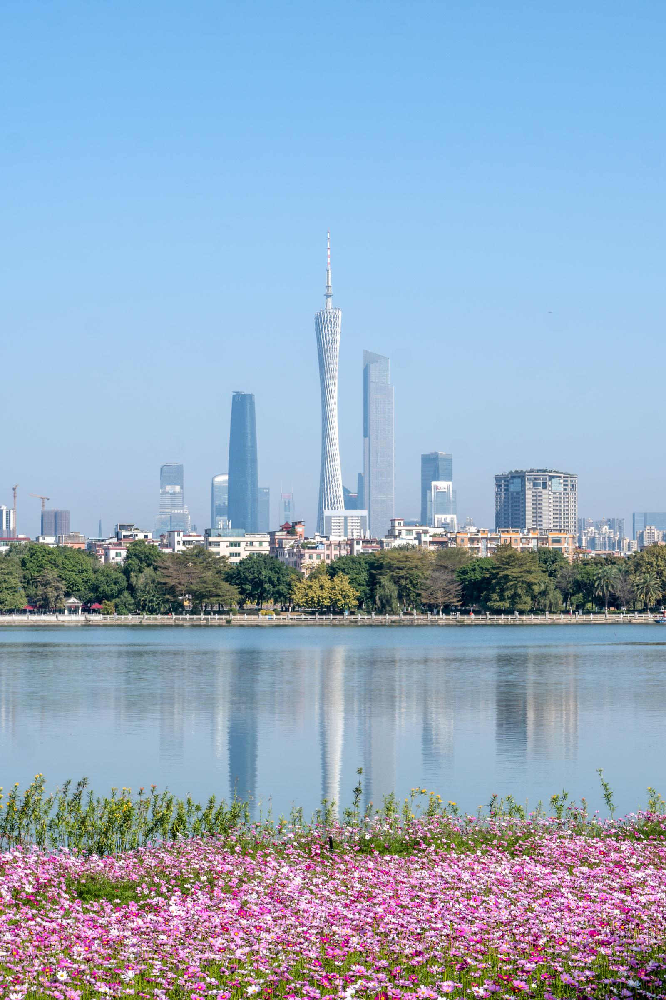

# 海珠湖公园

## 景点图片

> 图片来源：[Wikimedia Commons](https://commons.wikimedia.org/wiki/File:Haizhu_Lake_Park.jpg) · 许可证：CC BY-SA 4.0

## 基本信息

| 项目 | 内容 |
|------|------|
| 景点名称 | 海珠湖公园 |
| 所在城市 | 广州市 |
| 所在区县 | 海珠区 |
| 景点级别 | - |
| 景点类型 | 公园 |
| 开放时间 | 全天开放 |
| 门票价格 | 免费 |

## 景点介绍

海珠湖公园位于海珠区中心地带，是广州市区内的大型人工湖公园。公园总面积约1500亩，其中水面面积约700亩。海珠湖于2011年建成开放，是广州市"花城绿城"建设的重要组成部分。

公园以湖心岛为核心，环湖建有绿道、栈道和多个景观节点。园内种植有大量岭南特色植物，四季花开不断，是市民休闲散步、骑行锻炼的好去处。

## 景点特点

- **城市湖泊**：广州市区内面积较大的人工湖之一
- **环湖绿道**：全长约6公里的环湖绿道，适合骑行和散步
- **花卉景观**：四季有不同的花卉，尤以格桑花和油菜花最为知名
- **亲水平台**：多处亲水平台，可近距离欣赏湖景
- **市民休闲**：免费开放，是周边居民日常休闲的好去处

## 位置

- **地址**：广州市海珠区新滘中路
- **经纬度**：23.0845°N, 113.3512°E

## 交通

- **地铁**：3号线大塘站B出口，步行约15分钟
- **公交**：264路、583路、761路等至海珠湖站
- **自驾**：可停放在公园周边停车场

## 数据来源

- [广州市林业和园林局](http://lyyl.gz.gov.cn/)

## 最后更新时间

2026-06-20
