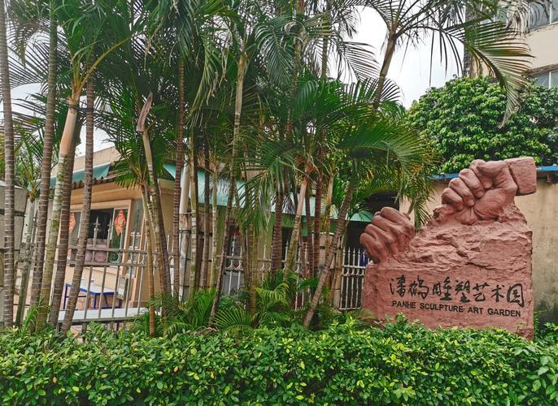

# 潘鹤雕塑艺术园

## 景点图片

## 基本信息

| 项目 | 内容 |
|------|------|
| 景点名称 | 潘鹤雕塑艺术园 |
| 所在城市 | 广州市 |
| 所在区县 | 海珠区 |
| 景点级别 | - |
| 景点类型 | 艺术园 |
| 开放时间 | 09:00-17:00（周二至周日，周一闭馆） |
| 门票价格 | 免费 |

## 景点介绍

潘鹤雕塑艺术园位于海珠区，是为展示著名雕塑家潘鹤先生的艺术成就而建立的专题艺术园区。潘鹤（1925-2020）是中国当代著名雕塑家，被誉为"中国城市雕塑的奠基人"之一。

园区内陈列了潘鹤先生的代表作品，包括《艰苦岁月》《开荒牛》《珠海渔女》等经典雕塑的原作或复制品。这些作品展现了潘鹤先生从艺七十余年的艺术成就，也记录了中国当代雕塑艺术的发展历程。

## 景点特点

- **雕塑艺术**：展示中国当代雕塑大师潘鹤的代表作品
- **经典作品**：《艰苦岁月》《开荒牛》《珠海渔女》等经典雕塑
- **艺术教育**：了解中国当代雕塑艺术发展历程
- **园林环境**：园区环境优美，适合散步观赏
- **免费开放**：免费向公众开放

## 位置

- **地址**：广州市海珠区
- **经纬度**：23.0689°N, 113.3159°E

## 交通

- **地铁**：3号线大塘站，步行约15分钟
- **公交**：可乘坐多路公交至海珠区相关站点
- **自驾**：可停放在周边停车场

## 数据来源

- [广州市文化广电旅游局](http://wlgz.gz.gov.cn/)

## 最后更新时间

2026-06-20
