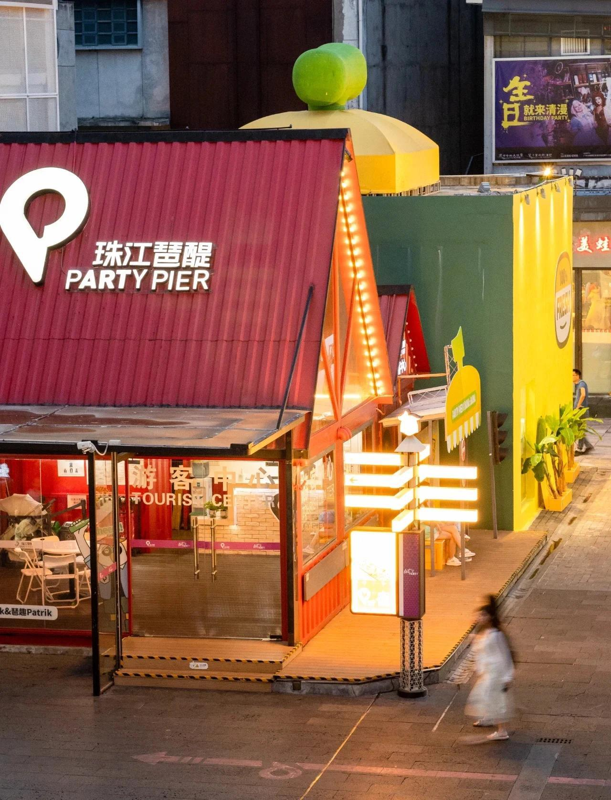
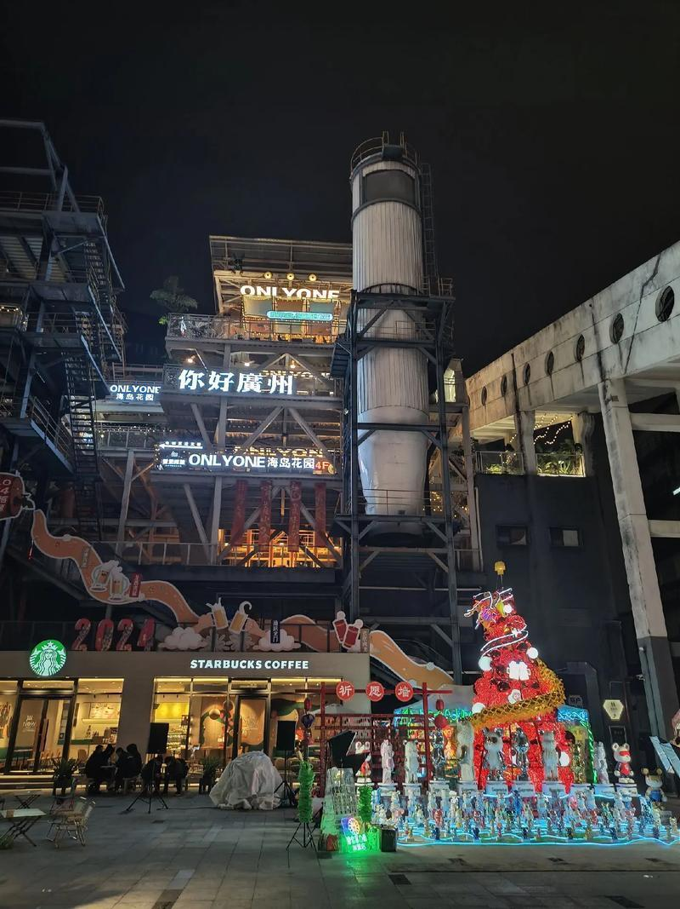
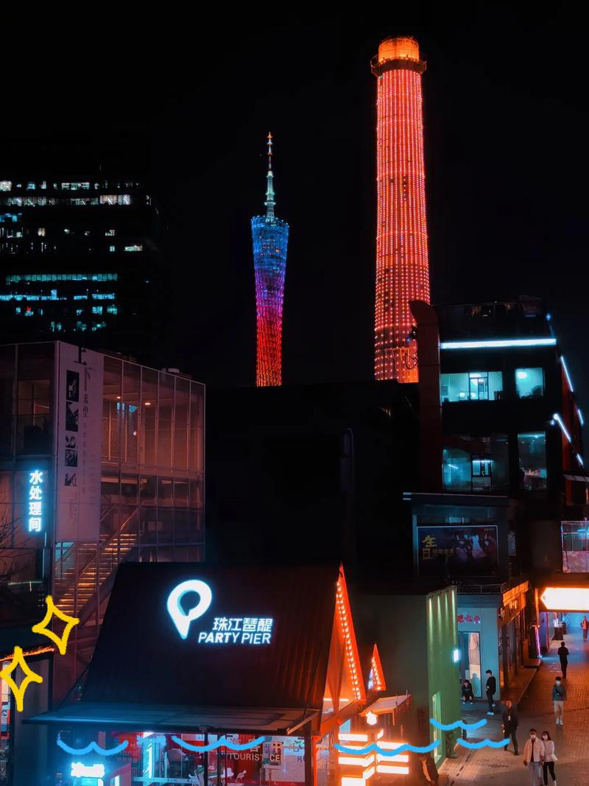

# 珠江·琶醍啤酒文化创意艺术区

## 景点图片

## 基本信息

| 项目 | 内容 |
|------|------|
| 景点名称 | 珠江·琶醍啤酒文化创意艺术区 |
| 所在城市 | 广州市 |
| 所在区县 | 海珠区 |
| 景点级别 | - |
| 景点类型 | 文创园区 |
| 开放时间 | 全天开放（商户营业时间各异） |
| 门票价格 | 免费 |

## 景点介绍

珠江·琶醍啤酒文化创意艺术区位于海珠区阅江西路，原为珠江啤酒厂旧址。园区依托珠江啤酒厂的工业遗产，经过活化改造，转型为集啤酒文化、创意艺术、餐饮娱乐于一体的综合性文创园区。

琶醍位于珠江边，与广州塔隔江相望，拥有绝佳的珠江夜景观赏位置。园区内保留了原有的工业建筑和啤酒生产设备，融合现代设计元素，成为广州夜生活和文艺活动的重要场所。

## 景点特点

- **工业遗产改造**：啤酒厂旧址改造的文创园区
- **珠江夜景**：与广州塔隔江相望，夜景绝佳
- **啤酒文化**：可品尝各种精酿啤酒，了解啤酒酿造工艺
- **文艺活动**：定期举办各类艺术展览和文化活动
- **网红打卡地**：广州热门的拍照和夜生活目的地

## 位置

- **地址**：广州市海珠区阅江西路磨碟沙大街118号
- **经纬度**：23.1071°N, 113.3402°E

## 交通

- **地铁**：APM线琶醍站
- **公交**：旅游观光1线、262路等至琶醍站
- **自驾**：可停放在园区停车场

## 数据来源

- [珠江琶醍啤酒文化创意艺术区](http://www.pati.com/)

## 最后更新时间

2026-06-20
