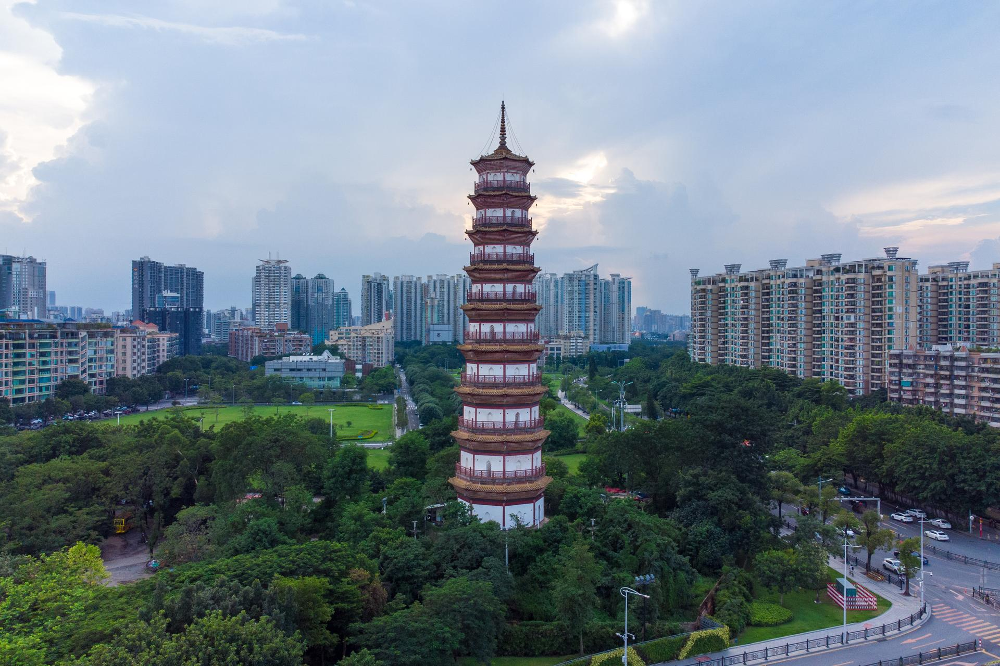

# 赤岗塔

## 景点图片

## 基本信息

| 项目 | 内容 |
|------|------|
| 景点名称 | 赤岗塔 |
| 所在城市 | 广州市 |
| 所在区县 | 海珠区 |
| 景点级别 | 广州市文物保护单位 |
| 景点类型 | 古塔 |
| 开放时间 | 不对外开放（外观可全天观赏） |
| 门票价格 | 免费（外观） |

## 景点介绍

赤岗塔位于广州市海珠区赤岗，是一座明代楼阁式砖塔，与琶洲塔、莲花塔并称为广州"珠江三塔"。赤岗塔建于明万历四十七年（1619年），由尚书李待问倡建，是广州古城的重要风水塔。

赤岗塔为八角形楼阁式砖塔，外观九层，内分十七层，高约50米。塔身造型优美，具有典型的明代建筑风格。塔基为红砂岩砌筑，塔身以青砖砌成，各层以菱角牙砖和挑檐砖相间叠涩出檐，体现了明代岭南建筑工艺的精湛水平。

赤岗塔地处珠江畔，与广州塔隔江相望，是广州历史与现代地标交相辉映的典型案例。

## 景点特点

- **广州"珠江三塔"之一**：与琶洲塔、莲花塔并列为珠江三塔
- **明代风水塔**：建于明万历四十七年（1619年），已有400余年历史
- **八角楼阁式砖塔**：外观九层，高约50米，典型明代建筑风格
- **广州市文物保护单位**：具有重要的历史文物价值
- **历史与现代交融**：与广州塔隔江相望，古今辉映

## 位置

- **地址**：广州市海珠区赤岗
- **经纬度**：23.0986°N, 113.3267°E

## 交通

- **地铁**：3号线/APM线广州塔站，或8号线赤岗站
- **公交**：旅游观光1线、121路、204路等
- **自驾**：周边有公共停车场

## 数据来源

- [百度百科-赤岗塔](https://baike.baidu.com/item/赤岗塔)

## 最后更新时间

2026-06-28
