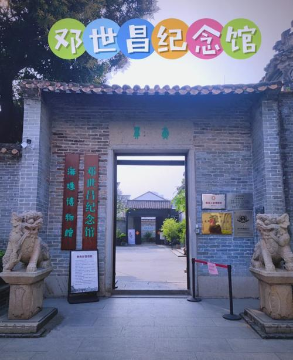

# 邓世昌纪念馆

## 景点图片

## 基本信息

| 项目 | 内容 |
|------|------|
| 景点名称 | 邓世昌纪念馆 |
| 所在城市 | 广州市 |
| 所在区县 | 海珠区 |
| 景点级别 | - |
| 景点类型 | 纪念馆 |
| 开放时间 | 09:00-17:00（周二至周日，周一闭馆） |
| 门票价格 | 免费 |

## 景点介绍

邓世昌纪念馆位于海珠区宝岗大道龙涎里，是为纪念甲午海战民族英雄邓世昌而建立的专题纪念馆。纪念馆依托邓世昌的故居"邓氏宗祠"而建，该祠堂始建于清代，是一座典型的岭南祠堂建筑。

邓世昌（1849-1894），广东番禺人，清末北洋水师致远舰管带。在1894年中日甲午海战中，邓世昌指挥致远舰奋勇作战，在弹药将尽之际下令全速撞击日舰吉野号，不幸被鱼雷击中，与全舰官兵壮烈殉国。

## 景点特点

- **民族英雄纪念**：纪念甲午海战英雄邓世昌
- **清代祠堂建筑**：保存较好的岭南祠堂建筑群
- **历史文物**：馆藏邓世昌相关文物和历史资料
- **爱国主义教育**：广州市爱国主义教育基地
- **古树名木**：园内有百年古树

## 位置

- **地址**：广州市海珠区宝岗大道龙涎里2号
- **经纬度**：23.1089°N, 113.2567°E

## 交通

- **地铁**：2号线市二宫站D出口，步行约20分钟
- **公交**：5路、10路、16路等至宝岗大道中站
- **自驾**：可停放在周边停车场

## 数据来源

- [广州市文化广电旅游局](http://wlgz.gz.gov.cn/)

## 最后更新时间

2026-06-20
