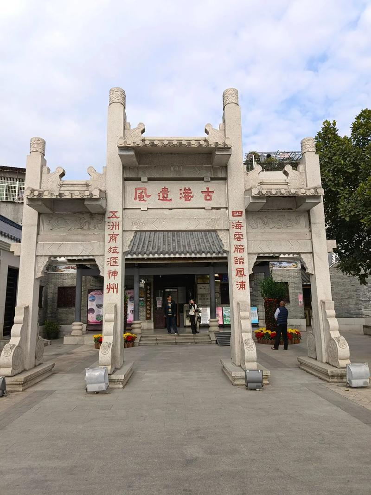

# 黄埔古港

## 景点图片

## 基本信息

| 项目 | 内容 |
|------|------|
| 景点名称 | 黄埔古港 |
| 所在城市 | 广州市 |
| 所在区县 | 海珠区 |
| 景点级别 | - |
| 景点类型 | 历史遗址 |
| 开放时间 | 全天开放（展馆09:00-17:00） |
| 门票价格 | 免费 |

## 景点介绍

黄埔古港位于海珠区琶洲街黄埔村，是古代海上丝绸之路的重要起点之一。清代康熙年间至鸦片战争前（1757-1842），这里是中国唯一的对外通商口岸，外国商船必须在此停泊交易，被称为"一口通商"时期。

黄埔古港见证了广州作为中国对外贸易中心的辉煌历史。现存有古港遗址、黄埔税馆、夷务所、买办馆等历史建筑，以及大量的古祠堂、古庙宇和古民居。

## 景点特点

- **海上丝绸之路遗址**：古代中国最重要的对外贸易港口之一
- **一口通商历史**：清代唯一对外通商口岸的历史见证
- **古村落风貌**：保存较好的岭南古村落，有大量祠堂和古建筑
- **粤海第一关**：清代粤海关的重要组成部分
- **美食文化**：周边有众多广州传统美食

## 位置

- **地址**：广州市海珠区琶洲街黄埔村
- **经纬度**：23.0934°N, 113.3789°E

## 交通

- **地铁**：4号线/8号线万胜围站B出口，步行约15分钟
- **公交**：229路、262路、564路等至黄埔古港站
- **自驾**：可停放在古港停车场

## 数据来源

- [广州市文化广电旅游局](http://wlgz.gz.gov.cn/)

## 最后更新时间

2026-06-20
