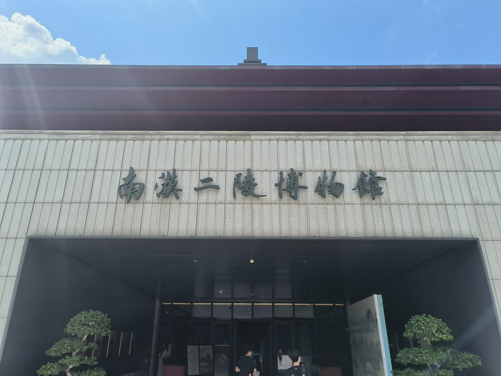

# 南汉二陵博物馆

## 景点图片

> 图片拍摄于 2025-06-24。来源：[Wikimedia Commons](https://commons.wikimedia.org/wiki/File:%E5%8D%97%E6%B1%89%E4%BA%8C%E9%99%B5%E5%8D%9A%E7%89%A9%E9%A6%86%E6%AD%A3%E9%97%A8%E8%BF%91%E6%99%AF%EF%BC%8C2025%E5%B9%B46%E6%9C%88.jpg) · 作者：Zhujianfei · 许可证：[CC BY-SA 4.0](https://creativecommons.org/licenses/by-sa/4.0/)

## 基本信息

| 项目 | 内容 |
|------|------|
| 景点名称 | 南汉二陵博物馆 |
| 所在城市 | 广州市 |
| 所在区县 | 番禺区 |
| 景点级别 | 全国重点文物保护单位 |
| 景点类型 | 博物馆 |
| 开放时间 | 09:00-17:00（周一闭馆） |
| 门票价格 | 免费 |

## 景点介绍

南汉二陵博物馆位于广州市番禺区小谷围岛（广州大学城），是依托五代十国时期南汉国两位皇帝的陵墓——康陵和德陵而建立的考古遗址博物馆。南汉二陵于2003年在大学城建设中被发现，2004年被评为全国十大考古新发现之一，2006年被列为全国重点文物保护单位。

博物馆占地面积约8500平方米，于2019年正式对外开放。馆内设有"汉风唐韵——南汉历史陈列"基本陈列，通过出土文物、模型、多媒体等手段，全面展示南汉国的历史文化。康陵是目前发现的中国五代十国时期唯一布局完整的帝陵。

## 景点特点

- **全国重点文物保护单位**：五代十国时期帝陵
- **全国十大考古新发现**：2004年入选
- **南汉国历史**：展示五代十国时期岭南割据政权历史
- **康陵**：中国唯一布局完整的五代帝陵
- **免费开放**：公众可免费参观

## 位置

- **地址**：广州市番禺区大学城华师一路8号
- **经纬度**：23.0471°N, 113.3841°E

## 交通

- **地铁**：4号线大学城北站D出口，步行约15分钟
- **公交**：大学城环线1路、环线2路至博物馆站
- **自驾**：可停放至博物馆停车场

## 数据来源

- [百度百科-南汉二陵](https://baike.baidu.com/item/南汉二陵)

## 最后更新时间

2026-06-25
