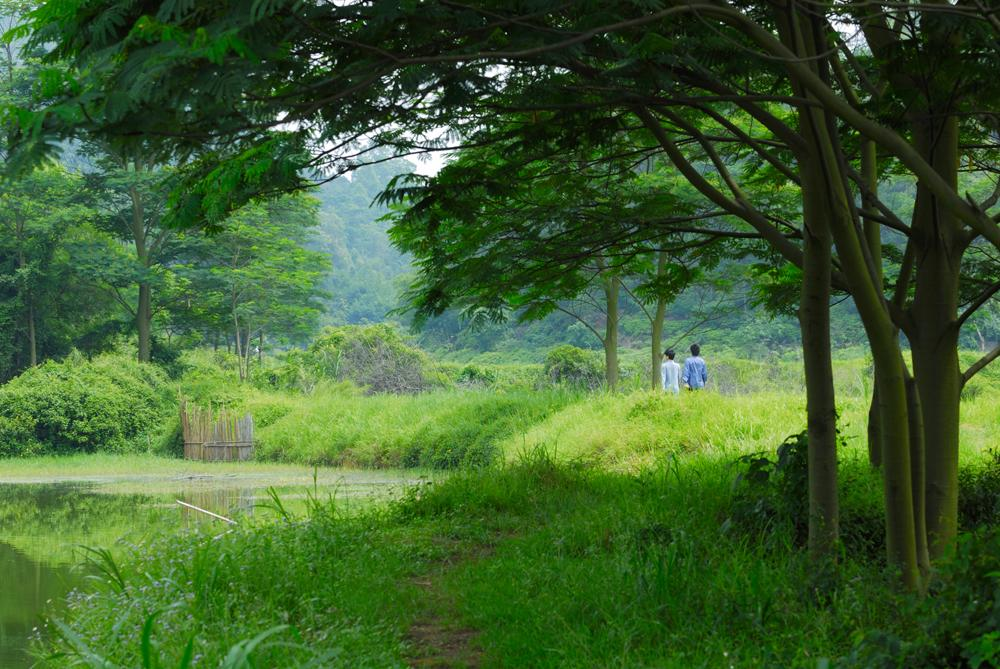

# 大夫山森林公园

## 景点图片

> 图片来源：[Wikimedia Commons](https://commons.wikimedia.org/wiki/File:Dafu_Mountain_Forest_Park.jpg) · 许可证：CC BY-SA 4.0

## 基本信息

| 项目 | 内容 |
|------|------|
| 景点名称 | 大夫山森林公园 |
| 所在城市 | 广州市 |
| 所在区县 | 番禺区 |
| 景点级别 | - |
| 景点类型 | 森林公园 |
| 开放时间 | 08:00-18:00 |
| 门票价格 | 免费 |

## 景点介绍

大夫山森林公园位于广州市番禺区市桥街道，占地约9000亩，是番禺区最大的综合性公园，也是广州市民周末休闲的热门去处。公园因园内的大夫山（主峰海拔226米）而得名。

大夫山森林公园以湖光山色和丰富的植物景观为特色，园内有大小湖泊7个，水面面积约1500亩，湖畔绿树成荫，亭台楼阁点缀其间。公园分为烧烤区、风筝场、自行车道、垂钓区等多个功能区域。

公园内设有全长约10公里的环湖自行车道，是广州最受欢迎的骑行路线之一。园内还设有烧烤场、儿童游乐场、篮球场等设施，是家庭出游和团队活动的理想场所。

## 景点特点

- **番禺最大公园**：占地约9000亩
- **七湖相连**：水面面积约1500亩
- **环湖骑行**：10公里自行车道
- **免费开放**：市民休闲的好去处
- **多功能休闲**：烧烤、垂钓、运动等
- **湖光山色**：自然环境优美

## 位置

- **地址**：广州市番禺区市桥街道禺山西路668号
- **经纬度**：22.9333°N, 113.3500°E

## 交通

- **地铁**：3号线市桥站，转乘番16路公交
- **公交**：番16路、番26路至大夫山森林公园站
- **自驾**：可停放至公园停车场

## 数据来源

- [百度百科-大夫山森林公园](https://baike.baidu.com/item/大夫山森林公园)

## 最后更新时间

2026-06-25
