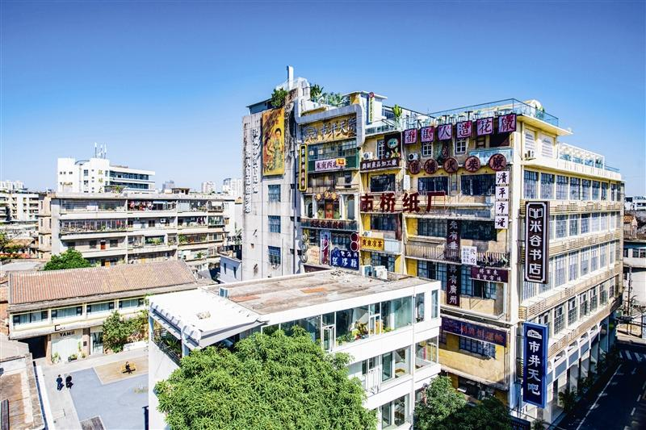

# 广州市西坊大院文化旅游区

## 景点图片

## 基本信息

| 项目 | 内容 |
|------|------|
| 景点名称 | 广州市西坊大院文化旅游区 |
| 所在城市 | 广州市 |
| 所在区县 | 番禺区 |
| 景点级别 | 3A级景区 |
| 景点类型 | 工业遗产、文化创意旅游区 |
| 开放时间 | 园区公共区域全天开放，展馆、活动及商户以各自公告为准 |
| 门票价格 | 园区公共区域免费，展览和消费项目另行收费 |

## 景点介绍

广州市西坊大院文化旅游区位于番禺区市桥老城区，前身为番禺区地方国营农副产品综合加工厂。园区保留红砖瓦房群落、苏式历史建筑和改革开放时期的工厂车间，已列入广州市工业遗产保护名录。

景区通过微改造建设游客服务中心、乡愁博览馆、艺展中心、番禺非遗工艺街和骑楼街，并举办文创市集、书友节、音乐会、非遗展演、艺术展览及读书会等活动，形成展示“老西坊”“老市桥”和“老番禺”工业与城市记忆的文化空间。

## 景点特点

- **广州工业遗产**：保留红砖厂房、苏式建筑和老车间
- **乡愁主题展示**：呈现番禺老城及工业发展记忆
- **非遗与艺术空间**：设有非遗工艺街、艺展中心和乡愁博览馆
- **公共文化活动**：持续举办市集、音乐会、展览和读书活动

## 位置

- **地址**：广州市番禺区市桥街环城西路264号
- **经纬度**：22.9371°N, 113.3573°E

## 交通

- **地铁**：3号线市桥站，转乘公交或步行前往
- **公交**：乘坐途经环城西路、市桥文化中心一带的公交线路

## 数据来源

- [番禺区人民政府：西坊大院文化旅游区获评国家3A级旅游景区](https://www.panyu.gov.cn/gkmlpt/content/8/8947/mpost_8947989.html)
- [广州市文化广电旅游局：2025年度国家3A级旅游景区质量等级复核结果](https://wglj.gz.gov.cn/xxgk/gzdt/tzgsgg/content/post_10480870.html)
- 图片来源：广州市番禺区人民政府

## 最后更新时间

2026-07-14
