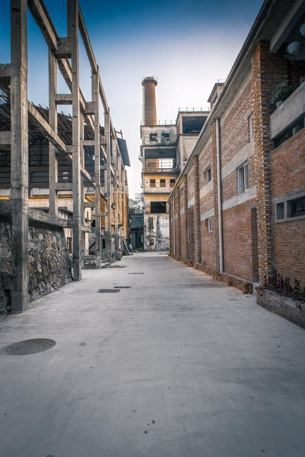

# 紫泥堂创意园

## 景点图片

## 基本信息

| 项目 | 内容 |
|------|------|
| 景点名称 | 紫泥堂创意园 |
| 所在城市 | 广州市 |
| 所在区县 | 番禺区 |
| 景点级别 | - |
| 景点类型 | 文创园区 |
| 开放时间 | 全天开放（商户营业时间各异） |
| 门票价格 | 免费 |

## 景点介绍

紫泥堂创意园位于广州市番禺区沙湾镇紫坭村，由原紫坭糖厂旧厂房改造而成，占地约12万平方米。紫坭糖厂始建于1953年，曾是广东最大的糖厂之一，2000年停产，后被改造为文化创意产业园。

紫泥堂创意园保留了大量工业时代的红砖厂房、烟囱、管道等建筑元素，将旧工业遗产与现代艺术创意相结合。园区内设有艺术工作室、展览空间、特色餐厅、咖啡馆等，定期举办艺术展览、创意市集和文化活动。

紫泥堂以其独特的工业美学氛围和浓郁的文艺气息，吸引了众多艺术家和文艺青年，是广州文艺打卡的热门目的地，也是摄影爱好者的天堂。

## 景点特点

- **工业遗产活化**：由1953年旧糖厂改造
- **红砖厂房美学**：保留大量工业时代建筑
- **艺术展览**：定期举办各类当代艺术展
- **创意市集**：周末创意集市
- **文艺打卡地**：广州知名的文创园区
- **免费开放**：可自由参观

## 位置

- **地址**：广州市番禺区沙湾镇紫坭村
- **经纬度**：22.8958°N, 113.2958°E

## 交通

- **地铁**：3号线市桥站，转乘番67路公交
- **公交**：番67路至紫坭村站
- **自驾**：经沙湾大桥或北斗大桥至紫坭村

## 数据来源

- [百度百科-紫泥堂](https://baike.baidu.com/item/紫泥堂)

## 最后更新时间

2026-06-25
