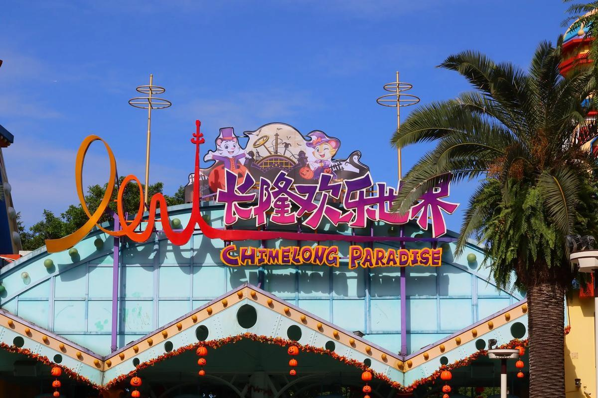

# 长隆欢乐世界

## 景点图片

## 基本信息

| 项目 | 内容 |
|------|------|
| 景点名称 | 长隆欢乐世界 |
| 所在城市 | 广州市 |
| 所在区县 | 番禺区 |
| 景点级别 | 5A级景区 |
| 景点类型 | 主题公园 |
| 开放时间 | 10:00-21:00（具体以官网公告为准） |
| 门票价格 | 约250-350元/人 |

## 景点介绍

长隆欢乐世界位于广州市番禺区长隆旅游度假区内，是国家AAAAA级旅游景区，也是中国顶级的主题乐园之一。长隆欢乐世界占地面积约2000亩，拥有众多大型游乐设施和精彩表演。

长隆欢乐世界拥有超过70项游乐设施，包括垂直过山车、十环过山车、摩托过山车、U型滑板等刺激的游乐项目。园内还有国际特技表演、魔术表演、花车巡游等精彩节目。

长隆欢乐世界是广州最受欢迎的主题公园之一，与长隆野生动物世界、长隆水上乐园共同构成了长隆旅游度假区，是珠三角地区游客休闲娱乐的首选之地。

## 景点特点

- **5A级景区**：中国顶级的主题乐园
- **70多项游乐设施**：垂直过山车、十环过山车等
- **精彩表演**：国际特技表演、魔术表演、花车巡游
- **长隆旅游度假区**：与野生动物世界、水上乐园共同构成
- **珠三角首选**：休闲娱乐的热门目的地

## 位置

- **地址**：广州市番禺区迎宾路长隆旅游度假区内
- **经纬度**：23.0072°N, 113.3130°E

## 交通

- **地铁**：3号线/7号线汉溪长隆站，转乘长隆免费穿梭巴士
- **公交**：304路、562路等至长隆站
- **自驾**：可停放至长隆停车场

## 数据来源

- [长隆欢乐世界官方网站](https://www.chimelong.com/paradise/)
- [百度百科-长隆欢乐世界](https://baike.baidu.com/item/长隆欢乐世界)

## 最后更新时间

2026-06-20
