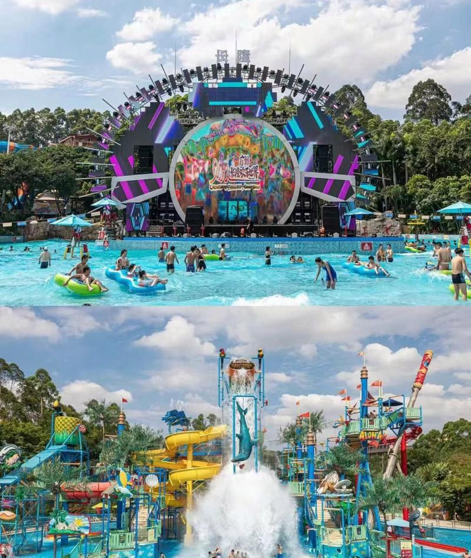

# 长隆水上乐园

## 景点图片

## 基本信息

| 项目 | 内容 |
|------|------|
| 景点名称 | 长隆水上乐园 |
| 所在城市 | 广州市 |
| 所在区县 | 番禺区 |
| 景点级别 | 5A级景区（长隆旅游度假区） |
| 景点类型 | 水上主题乐园 |
| 开放时间 | 10:00-21:00（夏季，具体以官网公告为准） |
| 门票价格 | 280元/人（成人票，旺季） |

## 景点介绍

长隆水上乐园位于广州市番禺区长隆旅游度假区内，是全球最大的水上乐园之一，也是长隆集团旗下四大主题公园之一。乐园于2007年开业，占地约450亩，拥有超过70个水上娱乐项目。

长隆水上乐园拥有多个世界级的水上设施，包括"超级大喇叭"、"巨蟒滑道"、"大滑板"、"喷射滑道"等。其中"摇滚巨轮"是全球首创的摇滚主题水上过山车，"巨洪峡"是全球最长的人工漂流河。乐园还设有适合儿童的"宝贝水城"区域。

每年夏季，长隆水上乐园都会举办"长隆水上电音节"等主题活动，吸引大量年轻游客。乐园曾连续多年获得"全球最佳水上乐园"称号。

## 景点特点

- **全球最大水上乐园之一**：占地约450亩
- **70+水上项目**：世界级水上娱乐设施
- **全球首创**：摇滚巨轮等创新项目
- **全球最佳水上乐园**：多次获国际大奖
- **电音节**：夏季主题活动
- **亲子友好**：设有儿童专属区域

## 位置

- **地址**：广州市番禺区迎宾路长隆旅游度假区内
- **经纬度**：23.0021°N, 113.3244°E

## 交通

- **地铁**：3号线/7号线汉溪长隆站E出口，步行约10分钟
- **公交**：129路、303A路等至长隆旅游度假区站
- **自驾**：可停放至长隆度假区停车场

## 数据来源

- [长隆水上乐园官方网站](https://www.chimelong.com/waterpark/)

## 最后更新时间

2026-06-25
