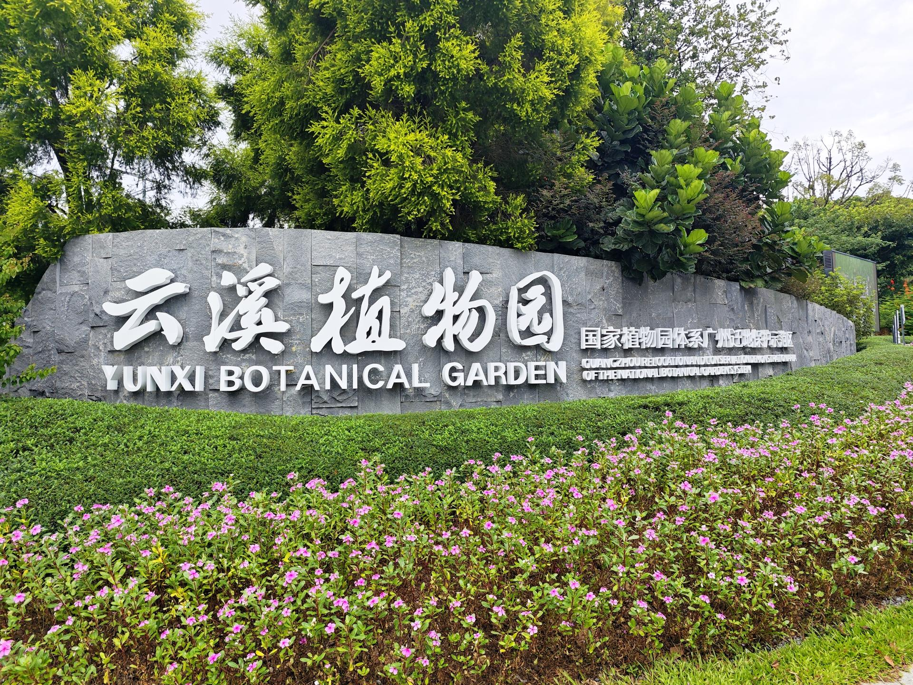

# 云溪植物园

## 景点图片

## 基本信息

| 项目 | 内容 |
|------|------|
| 景点名称 | 云溪植物园 |
| 所在城市 | 广州市 |
| 所在区县 | 白云区 |
| 景点级别 | - |
| 景点类型 | 植物园 |
| 开放时间 | 08:00-18:00 |
| 门票价格 | 免费 |

## 景点介绍

云溪植物园位于广州市白云区白云山北麓，与南麓的云萝植物园遥相呼应，共同构成白云山国家植物园体系。植物园以白云山自然溪涧景观为特色，充分利用山体水系，打造出独具岭南水韵的植物展示空间。

园区以"溪涧花谷"为主题，沿山谷溪流布局各类植物展示区。游客可沿溪流步道穿行于各植物专类园之间，欣赏溪水潺潺、花木葱茏的自然画卷。园内重点保育和展示华南地区乡土植物、水生植物和溪涧植物。

云溪植物园与云萝植物园功能互补，前者以溪涧生态为特色，后者以山地植物展示为主，共同为公众提供多元化的自然体验和科普教育服务。

## 景点特点

- **溪涧景观特色**：以白云山自然溪流为主线，打造溪涧植物景观
- **白云山北麓**：与云萝植物园形成南北呼应格局
- **免费开放**：无需门票即可入园游览
- **华南乡土植物**：重点展示华南地区本土植物资源
- **亲水步道**：沿溪流设有架空栈道和亲水平台

## 位置

- **地址**：广州市白云区白云山北麓
- **经纬度**：23.1800°N, 113.2900°E

## 交通

- **地铁**：2号线萧岗站或白云文化广场站，转乘公交前往
- **公交**：大学城1线、B18路等至白云山北门站
- **自驾**：可导航至白云山北门停车场

## 数据来源

- [百度百科-云溪植物园](https://baike.baidu.com/item/云溪植物园)

## 最后更新时间

2026-06-28
