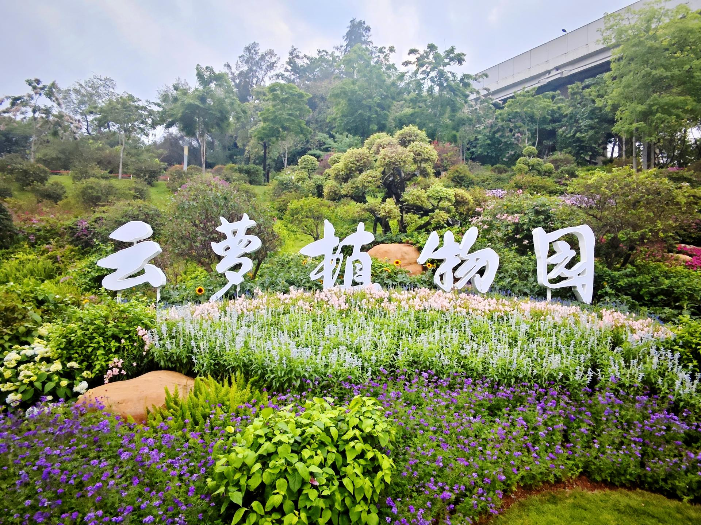

# 云萝植物园

## 景点图片

## 基本信息

| 项目 | 内容 |
|------|------|
| 景点名称 | 云萝植物园 |
| 所在城市 | 广州市 |
| 所在区县 | 白云区 |
| 景点级别 | - |
| 景点类型 | 植物园 |
| 开放时间 | 08:00-18:00 |
| 门票价格 | 免费（部分温室专题展区收费） |

## 景点介绍

云萝植物园位于广州市白云区白云山南麓，是白云山国家植物园体系的重要组成部分。植物园依托白云山丰富的自然生态环境，以收集、保育和展示华南地区植物资源为主要功能，集科研科普、休闲游览于一体。

园区占地面积广阔，园内规划有多个植物专类园区，包括兰花园、蕨类植物区、药用植物区、芳香植物区等。植物园以"云山珠水"为设计理念，充分利用山势地形，打造出错落有致的植物景观空间。

作为白云山国家植物园体系的核心园区之一，云萝植物园承担着植物多样性保护、科学研究和公众教育的重要职责，是广州市推进生态文明建设的重点工程。

## 景点特点

- **白云山国家植物园体系**：作为该体系的核心组成部分，与云溪植物园形成南北呼应
- **专类植物园区**：设有兰花园、蕨类植物区、药用植物区等多个主题园区
- **科普教育功能**：定期举办植物科普展览和自然教育活动
- **山地景观**：依白云山南麓而建，景观层次丰富
- **城市绿肺**：为广州市民提供亲近自然的休闲空间

## 位置

- **地址**：广州市白云区白云山南麓（近云台花园）
- **经纬度**：23.1600°N, 113.2900°E

## 交通

- **地铁**：2号线白云公园站，转乘公交或步行前往
- **公交**：24路、63路、245路等至云台花园站，步行可达
- **自驾**：可导航至白云山南门停车场

## 数据来源

- [百度百科-云萝植物园](https://baike.baidu.com/item/云萝植物园)

## 最后更新时间

2026-06-28
