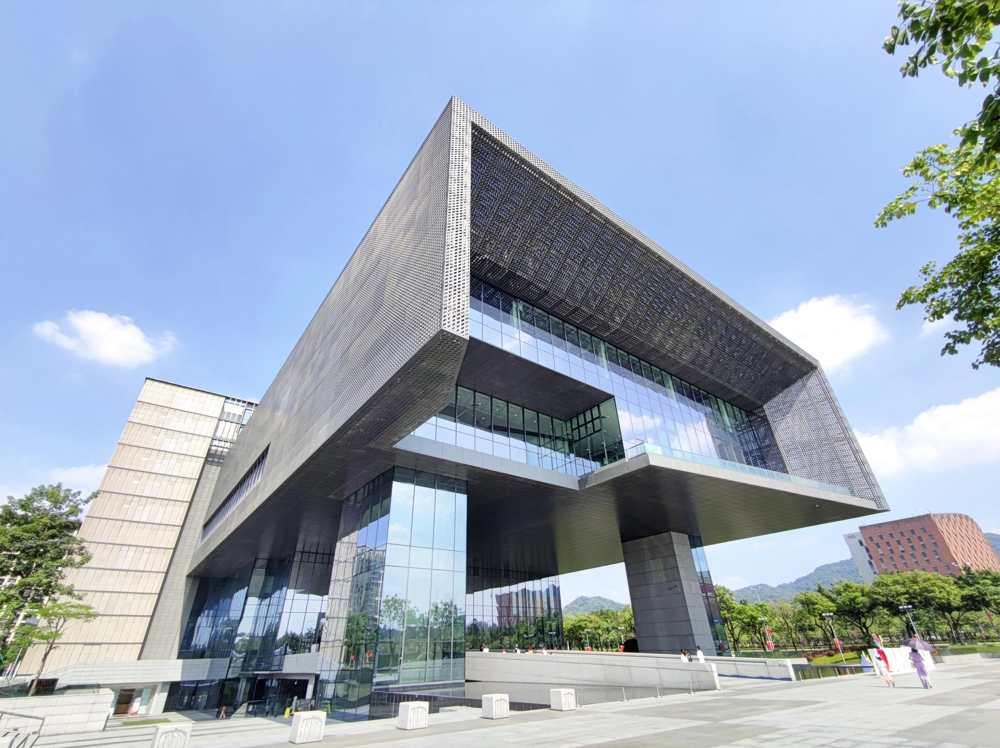

# 广州市城市规划展览中心旅游区

## 景点图片

> 图片拍摄于 2020-10-03。来源：[Wikimedia Commons](https://commons.wikimedia.org/wiki/File:Exterior,_Guangzhou_Urban_Planning_Exhibition_Center_20201003.jpg) · 作者：Jasonjiang.1998 · 许可证：[CC BY-SA 4.0](https://creativecommons.org/licenses/by-sa/4.0/)

## 基本信息

| 项目 | 内容 |
|------|------|
| 景点名称 | 广州市城市规划展览中心旅游区 |
| 所在城市 | 广州市 |
| 所在区县 | 白云区 |
| 景点级别 | 4A级景区 |
| 景点类型 | 城市规划展览、科普教育 |
| 开放时间 | 以场馆预约及开放公告为准 |
| 门票价格 | 以场馆公告为准 |

## 景点介绍

广州市城市规划展览中心旅游区位于白云区，通过城市模型、专题展览和数字化展示介绍广州的城市发展历程、空间规划和未来建设，是了解广州城市格局的重要公共文化场馆。

## 景点特点

- **城市总体模型**：直观展示广州城市空间结构
- **规划科普**：介绍城市建设、交通和生态规划知识
- **数字化展示**：运用多媒体技术呈现城市发展主题

## 位置

- **地址**：广州市白云区展览路1号

## 交通

- **地铁**：可乘广州地铁2号线至白云文化广场站
- **公交**：可乘公交前往白云文化广场周边站点

## 数据来源

- [广州市文化广电旅游局：广州市A级景区名录](http://wglj.gz.gov.cn/ggfw/lyl/lydwcx/content/post_10878689.html)

## 最后更新时间

2026-07-15
