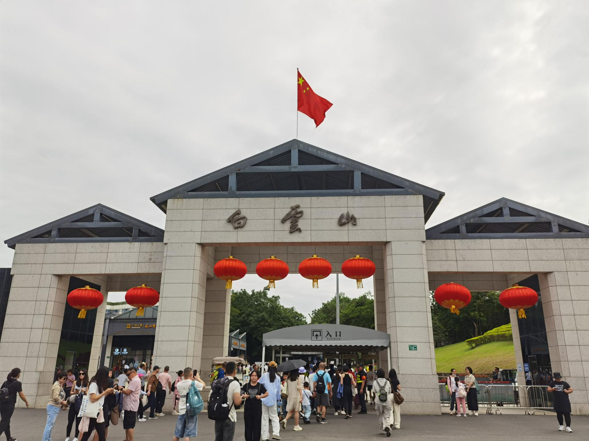

# 白云山

## 景点图片

## 基本信息

| 项目 | 内容 |
|------|------|
| 景点名称 | 白云山 |
| 所在城市 | 广州市 |
| 所在区县 | 白云区 |
| 景点级别 | 5A级景区 |
| 景点类型 | 风景名胜区 |
| 开放时间 | 全天开放（索道：09:00-18:00） |
| 门票价格 | 5元/人（摩星岭5元）；索道单程25元 |

## 景点介绍

白云山位于广州市白云区，是南粤名山之一，自古就有"羊城第一秀"之称。白云山由30多座山峰组成，主峰摩星岭海拔382米，是广州市最高峰。白云山总面积约20.98平方公里，是广州市唯一的5A级景区。

白云山风景区分为七个游览区：明珠楼游览区、摩星岭游览区、鸣春谷游览区、三台岭游览区、飞鹅岭游览区、荷依岭游览区和云台花园游览区。山上古迹众多，包括蒲涧、九龙泉、能仁寺、碑林等。白云山植被茂密，绿化覆盖率高达95%以上，空气清新，是广州市民登高望远、休闲健身的首选之地。

## 景点特点

- **羊城第一秀**：自古被誉为"羊城第一秀"，是广州最重要的自然景观
- **5A级景区**：广州市唯一的国家5A级旅游景区
- **摩星岭**：海拔382米，广州市最高峰，可俯瞰全城
- **云台花园**：以观赏花草为主的花园，四季花开不断
- **鸣春谷**：大型天然鸟笼，可观赏各种珍稀鸟类
- **能仁寺**：始建于清代的佛教寺庙
- **九龙泉**：传说有九条龙在此出没而得名

## 位置

- **地址**：广州市白云区广园中路
- **经纬度**：23.1847°N, 113.2839°E

## 交通

- **地铁**：2号线白云公园站、3号线永泰站，转乘公交
- **公交**：24路、63路、245路、285路、522路、B18路等至白云山各入口
- **自驾**：可停放至白云山南门、西门等停车场

## 数据来源

- [白云山风景名胜区官方网站](http://www.byslp.com/)
- [百度百科-白云山](https://baike.baidu.com/item/白云山/10192)

## 最后更新时间

2026-06-20
