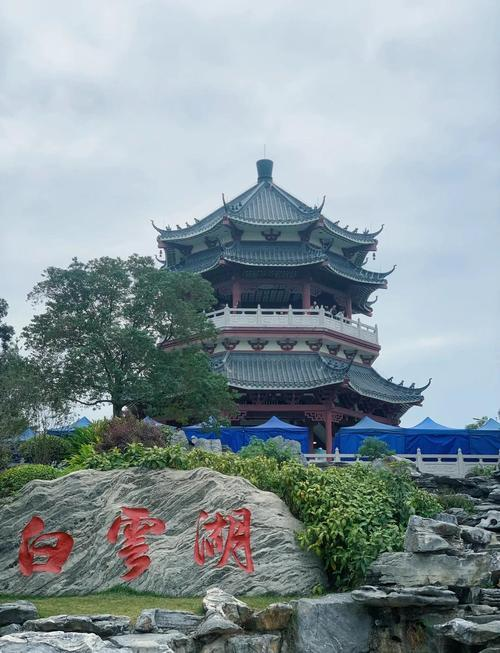

# 白云湖公园

## 景点图片

## 基本信息

| 项目 | 内容 |
|------|------|
| 景点名称 | 白云湖公园 |
| 所在城市 | 广州市 |
| 所在区县 | 白云区 |
| 景点级别 | - |
| 景点类型 | 综合性公园 |
| 开放时间 | 06:00-21:00 |
| 门票价格 | 免费 |

## 景点介绍

白云湖公园位于广州市白云区石井街道，是广州最大的人工湖公园，也是广州中心城区最大的综合性公园之一。公园于2011年建成开放，总面积约3000亩，其中水面面积约1500亩。

白云湖分为东湖和西湖两部分，湖中有多个岛屿，湖畔绿树成荫，花草繁茂。公园设有环湖绿道、亲水平台、儿童乐园、运动场等设施。环湖绿道全长约10公里，是广州最受欢迎的骑行和跑步路线之一。

白云湖不仅是市民休闲的好去处，也是广州重要的水利设施，承担着防洪排涝和生态补水的功能。每年春季，湖畔的宫粉紫荆和黄花风铃木盛开，景色优美。

## 景点特点

- **广州最大人工湖公园**：总面积约3000亩
- **环湖绿道**：10公里骑行跑步路线
- **免费开放**：市民休闲的好去处
- **四季花卉**：春季宫粉紫荆、黄花风铃木
- **亲水休闲**：亲水平台、儿童乐园
- **生态功能**：防洪排涝和生态补水

## 位置

- **地址**：广州市白云区石井街道白云湖大道
- **经纬度**：23.2000°N, 113.2333°E

## 交通

- **地铁**：8号线石井站，转乘公交
- **公交**：271路、522路至白云湖公园站
- **自驾**：可停放至公园停车场

## 数据来源

- [百度百科-白云湖](https://baike.baidu.com/item/白云湖_(广州))

## 最后更新时间

2026-06-25
