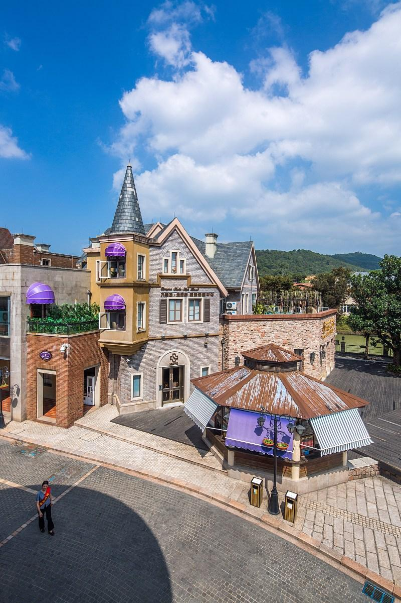

# 九龙湖度假区

## 景点图片

## 基本信息

| 项目 | 内容 |
|------|------|
| 景点名称 | 九龙湖度假区 |
| 所在城市 | 广州市 |
| 所在区县 | 花都区 |
| 景点级别 | 4A级景区 |
| 景点类型 | 生态度假区 |
| 开放时间 | 09:00-18:00 |
| 门票价格 | 30元/人（生态园） |

## 景点介绍

九龙湖度假区位于广州市花都区北兴镇，占地约14.1平方公里，是集生态观光、休闲度假、商务会议于一体的综合性旅游度假区。度假区因区内有九条山溪汇入湖泊而得名。

度假区以九龙湖为核心，湖面面积约3000亩，群山环抱，水质清澈。区内分为生态园、公主酒店、国王酒店、国际会议中心等多个功能区域。生态园内设有户外拓展基地、烧烤场、钓鱼台等设施。

九龙湖度假区是广州市民周末度假的热门选择，尤其适合家庭出游、团队建设和商务活动。区内空气清新，负氧离子含量高，是天然的氧吧。

## 景点特点

- **4A级景区**：花都区重要的旅游度假区
- **九龙湖**：3000亩湖面，群山环抱
- **生态观光**：自然环境优美，空气清新
- **户外拓展**：设有专业的拓展基地
- **商务会议**：完善的会议设施
- **家庭度假**：适合亲子出游和团队活动

## 位置

- **地址**：广州市花都区北兴镇九龙湖度假区
- **经纬度**：23.4333°N, 113.3667°E

## 交通

- **地铁**：3号线机场北站，转乘公交
- **公交**：花都汽车站转乘北兴方向班车
- **自驾**：经大广高速或京珠高速至北兴出口

## 数据来源

- [百度百科-九龙湖度假区](https://baike.baidu.com/item/九龙湖度假区)

## 最后更新时间

2026-06-25
