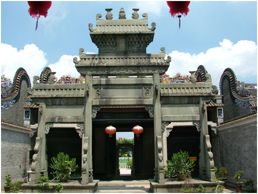

# 广州市资政大夫祠景区

## 景点图片

## 基本信息

| 项目 | 内容 |
|------|------|
| 景点名称 | 广州市资政大夫祠景区 |
| 所在城市 | 广州市 |
| 所在区县 | 花都区 |
| 景点级别 | 3A级景区 |
| 景点类型 | 民俗博物馆、古建筑群 |
| 开放时间 | 09:00-17:00，16:30停止入馆；周一闭馆，法定节假日除外 |
| 门票价格 | 票价及优惠政策以广州民俗博物馆现场公告为准 |

## 景点介绍

广州市资政大夫祠景区位于花都区新华街三华村，核心为广东省文物保护单位资政大夫祠古建筑群。广州民俗博物馆依托该建筑群设立，是展示花都及岭南民俗文化的专题性博物馆，也是广州市爱国主义教育基地和“花都新八景”之一。

馆内设有粤剧、灰塑、瑞岭盆景、珐琅和清代主人故事等五个常设展厅。古建筑群保存锅耳山墙、陶塑瓦脊、牌坊以及砖雕、木雕、石雕、灰塑等岭南传统建筑装饰工艺。

## 景点特点

- **广东省文物保护单位**：依托资政大夫祠古建筑群建设
- **五个常设展厅**：展示粤剧、灰塑、盆景、珐琅和地方历史
- **岭南建筑装饰**：集中观赏砖雕、木雕、石雕和灰塑
- **民俗专题博物馆**：连接古建筑保护与地方文化展示

## 位置

- **地址**：广州市花都区新华街三华村三华路40号
- **经纬度**：23.3867°N, 113.1917°E

## 交通

- **公交**：乘坐花31路、花32路或花32路短线至资政大夫祠站
- **自驾**：导航至广州民俗博物馆（资政大夫祠），按现场指引停车

## 数据来源

- [花都区人民政府：广州民俗博物馆（资政大夫祠）](https://www.huadu.gov.cn/zjhd/lyjq/content/post_8532685.html)
- [广州市文化广电旅游局：2025年度国家3A级旅游景区质量等级复核结果](https://wglj.gz.gov.cn/xxgk/gzdt/tzgsgg/content/post_10480870.html)
- 图片来源：广州市花都区人民政府

## 最后更新时间

2026-07-14
