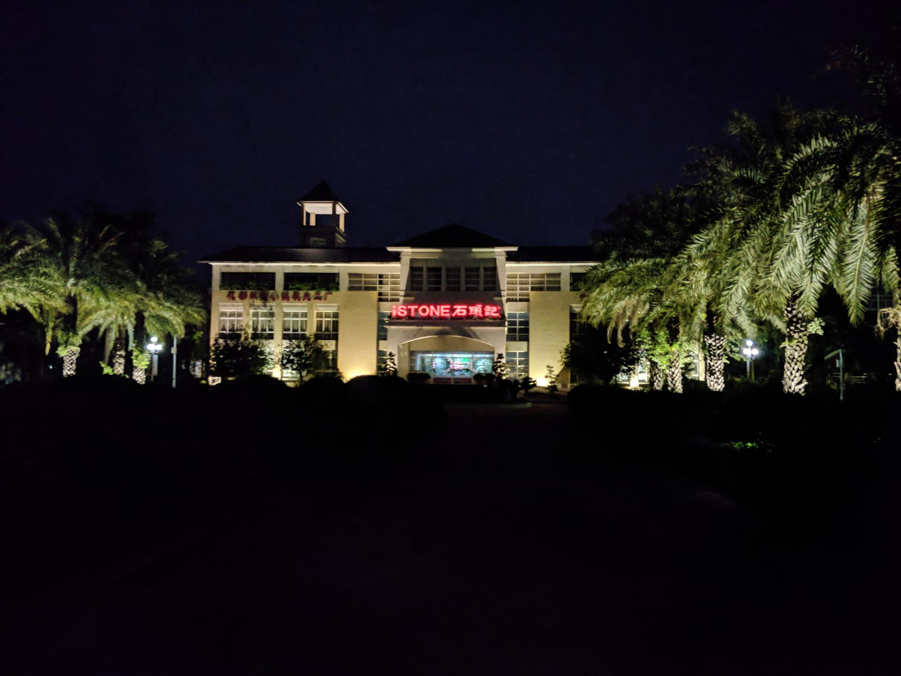

# 石头记矿物园

## 景点图片

> 图片拍摄于 2018-10-08。来源：[Wikimedia Commons](https://commons.wikimedia.org/wiki/File:%E5%B9%BF%E5%B7%9E%E5%B8%82%E8%8A%B1%E9%83%BD%E5%8C%BA%E7%9F%B3%E5%A4%B4%E8%AE%B0%E7%9F%BF%E7%89%A9%E5%9B%AD.jpg) · 作者：TrutH SuiTeR · 许可证：[CC BY-SA 4.0](https://creativecommons.org/licenses/by-sa/4.0/)

## 基本信息

| 项目 | 内容 |
|------|------|
| 景点名称 | 石头记矿物园 |
| 所在城市 | 广州市 |
| 所在区县 | 花都区 |
| 景点级别 | 4A级景区 |
| 景点类型 | 矿物科普、主题园区 |
| 开放时间 | 以景区当日公告为准 |
| 门票价格 | 以景区当日公告为准 |

## 景点介绍

石头记矿物园位于花都区珠宝产业集聚区域，以矿物晶体、宝石文化和地质科普展示为主要特色，是兼具观赏、科普和珠宝文化体验的主题景区。

## 景点特点

- **矿物展示**：展示多种天然矿石、晶体和宝石材料
- **地质科普**：通过展陈介绍矿物形成及辨识知识
- **珠宝文化**：与花都珠宝产业特色相结合

## 位置

- **地址**：广州市花都区珠宝城大观园路2号

## 交通

- **公交**：可乘花都区内公交前往珠宝城周边站点
- **自驾**：导航“石头记矿物园”，按现场指引停车

## 数据来源

- [广州市文化广电旅游局：广州市A级景区名录](http://wglj.gz.gov.cn/ggfw/lyl/lydwcx/content/post_10878689.html)

## 最后更新时间

2026-07-15
