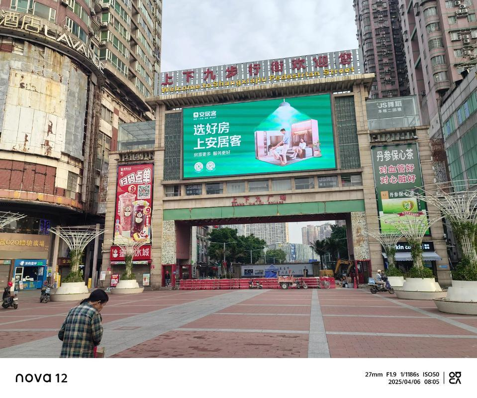

# 上下九步行街

## 景点图片

## 基本信息

| 项目 | 内容 |
|------|------|
| 景点名称 | 上下九步行街 |
| 所在城市 | 广州市 |
| 所在区县 | 荔湾区 |
| 景点级别 | 无 |
| 景点类型 | 历史文化商业街区 |
| 开放时间 | 全天开放（商铺营业时间：10:00-22:00） |
| 门票价格 | 免费 |

## 景点介绍

上下九步行街位于广州市荔湾区，是广州最著名的商业步行街之一，也是广州三大传统商业中心之一。步行街全长约1218米，由上九路、下九路和第十甫路组成，始建于宋代，至今已有近千年的历史。

上下九步行街最引人注目的是骑楼建筑群。街道两旁保存了大量清末民初时期的骑楼建筑，融合了岭南传统建筑和西方建筑风格，形成了独特的骑楼商业街景观。这些骑楼建筑是广州近代商业发展的重要见证。

步行街周边有众多老字号餐厅和小吃店，如陶陶居、莲香楼、广州酒家等，是品尝广州传统美食的绝佳去处。上下九步行街也是广州市民和游客购物休闲的热门去处。

## 景点特点

- **广州三大传统商业中心之一**：近千年的商业历史
- **骑楼建筑群**：保存大量清末民初时期的骑楼建筑
- **老字号美食**：陶陶居、莲香楼、广州酒家等
- **千年古街**：始建于宋代，至今近千年历史
- **购物休闲**：广州市民和游客的热门去处

## 位置

- **地址**：广州市荔湾区上下九路
- **经纬度**：23.1167°N, 113.2417°E

## 交通

- **地铁**：1号线长寿路站、8号线华林寺站
- **公交**：多路公交至上下九步行街站
- **自驾**：可停放至周边停车场

## 数据来源

- [百度百科-上下九步行街](https://baike.baidu.com/item/上下九步行街)

## 最后更新时间

2026-06-20
