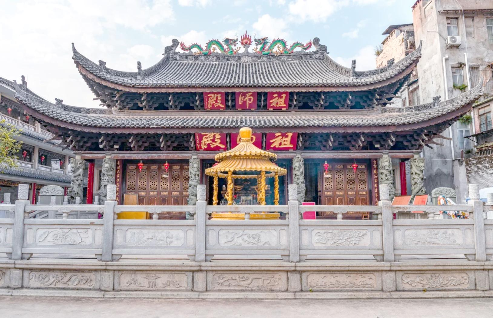

# 华林寺

## 景点图片

## 基本信息

| 项目 | 内容 |
|------|------|
| 景点名称 | 华林寺 |
| 所在城市 | 广州市 |
| 所在区县 | 荔湾区 |
| 景点级别 | 全国重点文物保护单位 |
| 景点类型 | 宗教寺庙 |
| 开放时间 | 08:00-17:00 |
| 门票价格 | 免费 |

## 景点介绍

华林寺位于广州市荔湾区下九路华林寺前31号，是广州著名的佛教寺院，也是全国重点文物保护单位。寺院始建于南朝梁武帝普通年间（520-527年），由天竺高僧达摩（禅宗初祖）所创建，初名"西来庵"，是达摩东渡中国在广州的登陆之地。

华林寺历经多次重修扩建，现存主要建筑有大雄宝殿、祖师殿、舍利殿等。寺内最珍贵的文物是佛祖释迦牟尼的舍利子，共21颗，是隋代从印度传入中国的，现供奉在舍利殿内。

华林寺前的华林玉器街是广州著名的玉器交易市场，与寺庙共同构成了独特的宗教文化与商业文化交融的景观。

## 景点特点

- **禅宗初祖达摩创建**：达摩东渡广州登陆之地
- **全国重点文物保护单位**：历史悠久的佛教寺院
- **佛祖舍利**：21颗释迦牟尼舍利子
- **西来初地**：达摩传法的起点
- **千年古刹**：始建于南朝梁代，距今近1500年
- **免费开放**：可入寺参观礼佛

## 位置

- **地址**：广州市荔湾区下九路华林寺前31号
- **经纬度**：23.1166°N, 113.2468°E

## 交通

- **地铁**：1号线长寿路站A出口，步行约5分钟
- **公交**：2路、3路、6路等至下九路站
- **自驾**：可停放至周边停车场

## 数据来源

- [百度百科-华林寺](https://baike.baidu.com/item/华林寺_(广州))

## 最后更新时间

2026-06-25
