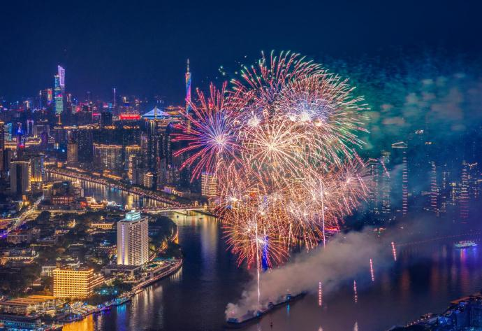

# 白鹅潭

## 景点图片

## 基本信息

| 项目 | 内容 |
|------|------|
| 景点名称 | 白鹅潭 |
| 所在城市 | 广州市 |
| 所在区县 | 荔湾区 |
| 景点级别 | - |
| 景点类型 | 滨水景观 |
| 开放时间 | 全天开放 |
| 门票价格 | 免费 |

## 景点介绍

白鹅潭位于广州市荔湾区，是珠江三段河道（珠江前航道、珠江后航道、鹤洞水道）的交汇处，水面宽阔，视野开阔。白鹅潭得名于古代传说——相传曾有白鹅在此出没，为珠江河段增添了几分神秘色彩。

白鹅潭自古就是广州重要的水路交通节点和商贸要地。明清时期，这里已是广州对外贸易的重要水域，外国商船多在此停泊。清代"十三行"时期，白鹅潭一带更是外商云集、帆樯如林，见证了广州作为"海上丝绸之路"重要港口的辉煌历史。

如今的白鹅潭已成为广州市区重要的滨水景观区域，沿岸建有景观步道、亲水平台和休闲广场。近年随着白鹅潭商务区的规划建设，以及大湾区艺术中心（白鹅潭大湾区艺术中心）的落成，该区域正焕发出新的城市活力。

## 景点特点

- **三江交汇**：珠江前航道、后航道、鹤洞水道在此交汇，水面壮阔
- **历史底蕴深厚**：自古为广州重要水路交通节点，见证海上丝绸之路历史
- **城市滨水景观**：沿岸景观步道和亲水平台适合散步观景
- **都市新地标**：周边有白鹅潭商务区和大湾区艺术中心等新建项目
- **夜景璀璨**：珠江两岸灯光秀的最佳观赏点之一
- **免费开放**：全天候开放式滨水公共空间

## 位置

- **地址**：广州市荔湾区白鹅潭（珠江三段河道交汇处）
- **经纬度**：23.1052°N, 113.243°E

## 交通

- **地铁**：1号线芳村站，步行约10分钟可达白鹅潭畔
- **公交**：19路、52路、64路等至芳村站或白鹅潭站
- **自驾**：可停放至白鹅潭周边商业停车场

## 数据来源

- [百度百科-白鹅潭](https://baike.baidu.com/item/白鹅潭)

## 最后更新时间

2026-06-28
