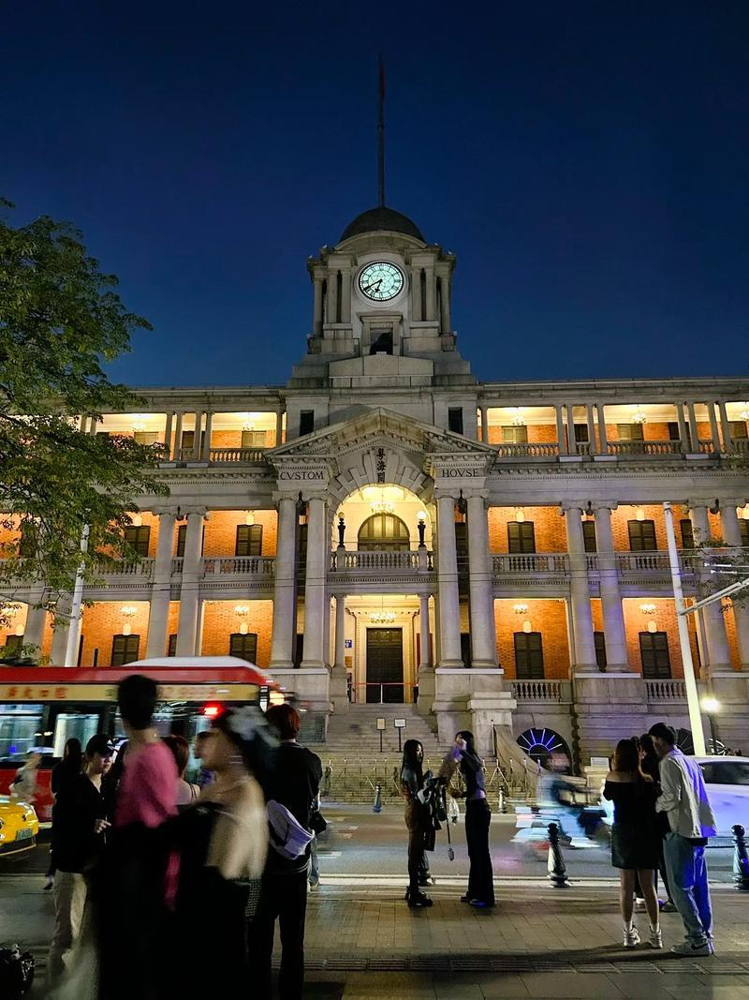

# 粤海关博物馆

## 景点图片

## 基本信息

| 项目 | 内容 |
|------|------|
| 景点名称 | 粤海关博物馆（广州海关旧址） |
| 所在城市 | 广州市 |
| 所在区县 | 荔湾区 |
| 景点级别 | 省级文物保护单位 |
| 景点类型 | 博物馆 |
| 开放时间 | 09:00-16:00（周一至周五）；周末及法定节假日闭馆 |
| 门票价格 | 免费（凭身份证参观） |

## 景点介绍

粤海关博物馆位于广州市荔湾区沿江西路29号，是中国最早的海关之一——粤海关的旧址所在地，也是广州近现代史的重要见证。博物馆建筑建于1916年，由英国建筑师戴卫德·迪克设计，是广州近代西洋新古典主义建筑的代表作。

粤海关大楼最引人注目的是其顶部的钟楼，高13米，内有四面大钟，是广州近代城市的地标之一，俗称"大钟楼"。大楼主体为钢筋混凝土结构，外观为仿古罗马式样，正面以花岗岩砌筑，气势恢宏。

博物馆内部展示了粤海关自清康熙二十四年（1685年）设立以来三百多年的历史变迁，通过丰富的文物、档案和图片，展现了中国海关从古代到近现代的发展历程。

## 景点特点

- **广州"大钟楼"**：粤海关大楼顶部钟楼，高13米，是广州近代城市地标
- **西洋古典建筑**：新古典主义风格，1916年建成，广州近代建筑代表作
- **省级文物保护单位**：具有重要的历史文物价值
- **海关历史展览**：展示粤海关三百多年历史变迁
- **珠江畔地标**：位于沿江西路，毗邻珠江，与沙面隔江相望

## 位置

- **地址**：广州市荔湾区沿江西路29号
- **经纬度**：23.1073°N, 113.251°E

## 交通

- **地铁**：6号线文化公园站或一德路站，步行约5分钟
- **公交**：4路、31路、57路等多路公交车至文化公园站
- **自驾**：周边有公共停车场

## 数据来源

- [百度百科-粤海关博物馆](https://baike.baidu.com/item/粤海关博物馆)

## 最后更新时间

2026-06-28
