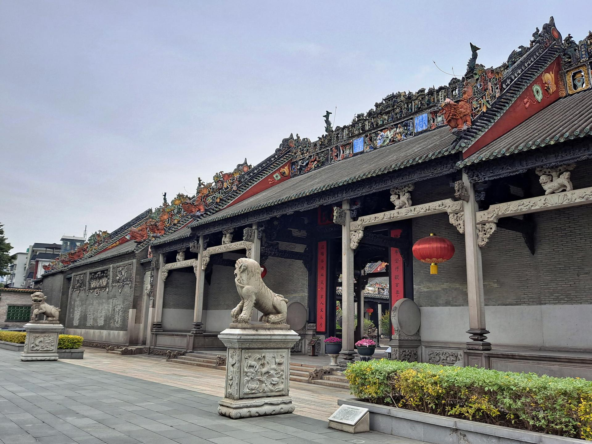

# 陈家祠

## 景点图片

> 图片来源：[Wikimedia Commons](https://commons.wikimedia.org/wiki/File:Chen_Clan_Ancestral_Hall.jpg) · 许可证：CC BY-SA 4.0

## 基本信息

| 项目 | 内容 |
|------|------|
| 景点名称 | 陈家祠（陈氏书院） |
| 所在城市 | 广州市 |
| 所在区县 | 荔湾区 |
| 景点级别 | 全国重点文物保护单位 |
| 景点类型 | 历史建筑/博物馆 |
| 开放时间 | 08:30-17:30（17:00停止入馆）；每月最后一周的周一闭馆（法定节假日除外） |
| 门票价格 | 10元/人 |

## 景点介绍

陈家祠，又称"陈氏书院"，是广东省广州市著名的清代宗祠建筑，位于荔湾区中山七路。始建于清光绪十四年（1888年），建成于光绪二十年（1894年），由广东省七十二县陈姓宗亲合资兴建，是广东现存规模最大、保存最完好、装饰最精美的清代祠堂建筑之一。

陈家祠集岭南建筑装饰艺术之大成，以"三雕两塑"（石雕、砖雕、木雕、陶塑、灰塑）闻名于世。建筑总面积约8000平方米，由三进五间、九堂六院组成，布局严谨对称，气势恢宏。其装饰工艺之精美、题材之丰富，堪称岭南建筑艺术的瑰宝，被誉为"岭南建筑艺术的明珠"。

现为**广东民间工艺博物馆**所在地，馆内收藏和展示广东传统工艺精品，包括牙雕、玉雕、木雕、广彩、广绣、端砚等。

## 景点特点

- **三雕两塑**：石雕、砖雕、木雕、陶塑、灰塑等建筑装饰艺术登峰造极
- **岭南建筑典范**：广东现存规模最大、保存最完好的清代祠堂建筑
- **广东民间工艺博物馆**：展示广东传统工艺精品
- **装饰题材丰富**：花鸟鱼虫、历史故事、戏曲人物等应有尽会
- **建筑布局**：三进五间、九堂六院，布局严谨对称

## 位置

- **地址**：广州市荔湾区中山七路恩龙里34号
- **经纬度**：23.1267°N, 113.2442°E

## 交通

- **地铁**：1号线/8号线陈家祠站D出口
- **公交**：17路、85路、88路、104路、107路、109路、114路、128路等
- **自驾**：可停放至周边停车场

## 数据来源

- [广东民间工艺博物馆官方网站](http://www.gzcl.com/)
- [百度百科-陈家祠](https://baike.baidu.com/item/陈家祠)

## 最后更新时间

2026-06-20
