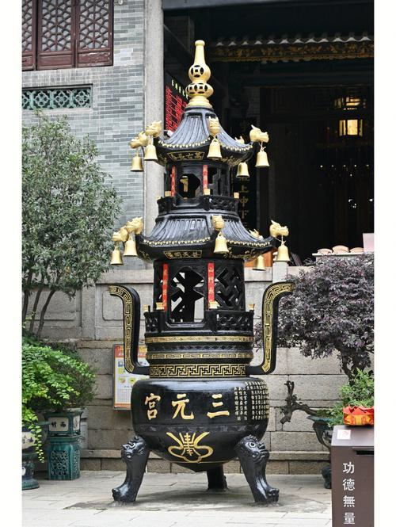

# 三元宫

## 景点图片

## 基本信息

| 项目 | 内容 |
|------|------|
| 景点名称 | 三元宫 |
| 所在城市 | 广州市 |
| 所在区县 | 越秀区 |
| 景点级别 | 广州市文物保护单位 |
| 景点类型 | 宗教建筑 |
| 开放时间 | 08:00-17:00 |
| 门票价格 | 免费 |

## 景点介绍

三元宫位于广州市越秀区应元路11号越秀山南麓，是广州规模最大、历史最悠久的道教宫观，也是广州市文物保护单位。三元宫始建于东晋大兴三年（320年），距今已有1700多年历史，初名"越岗院"，明代改名为"三元宫"。

三元宫供奉的是道教"三元大帝"——天官、地官、水官，即上元天官、中元地官、下元水官。宫内主要建筑有山门、三元殿、老君殿、吕祖殿、鲍姑殿等。其中鲍姑殿供奉的是东晋著名女道士鲍姑，她是著名医学家葛洪之妻。

三元宫依越秀山而建，古木参天，环境幽静，是闹市中的一方净土。每逢初一、十五和道教节日，香火鼎盛，信众络绎不绝。

## 景点特点

- **广州最大道观**：规模最大的道教宫观
- **1700年历史**：始建于东晋，历史悠久
- **广州市文物保护单位**：重要的历史文化遗产
- **三元大帝**：供奉天官、地官、水官
- **鲍姑殿**：纪念东晋女道士鲍姑
- **免费开放**：可入宫参观

## 位置

- **地址**：广州市越秀区应元路11号
- **经纬度**：23.1389°N, 113.2667°E

## 交通

- **地铁**：2号线纪念堂站C出口，步行约10分钟
- **公交**：211路、旅游1线至三元宫站
- **自驾**：可停放至越秀公园停车场

## 数据来源

- [百度百科-三元宫](https://baike.baidu.com/item/三元宫_(广州))

## 最后更新时间

2026-06-25
