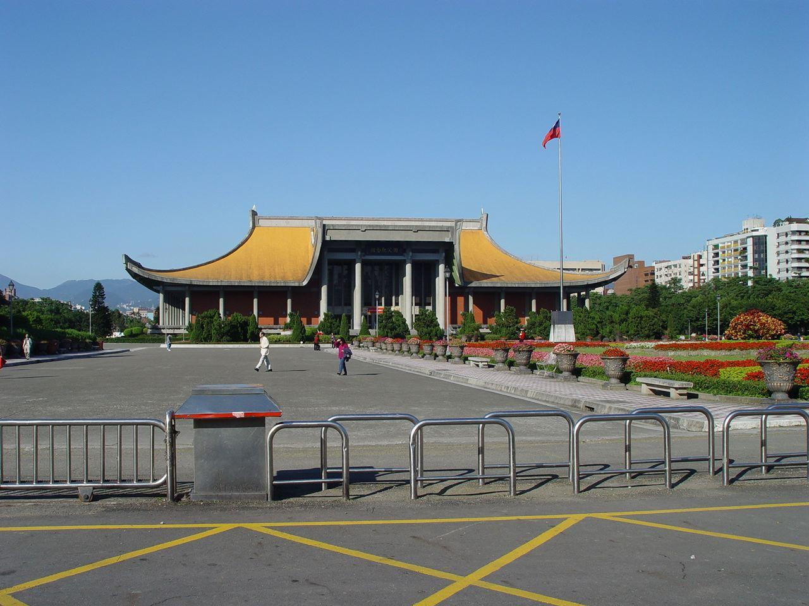

# 中山纪念堂

## 景点图片

## 基本信息

| 项目 | 内容 |
|------|------|
| 景点名称 | 中山纪念堂 |
| 所在城市 | 广州市 |
| 所在区县 | 越秀区 |
| 景点级别 | 全国重点文物保护单位、4A级景区 |
| 景点类型 | 纪念性建筑 |
| 开放时间 | 园区：06:00-22:00；主体建筑：09:00-18:00（17:30停止入场） |
| 门票价格 | 园区免费；主体建筑10元/人 |

## 景点介绍

广州中山纪念堂是为纪念伟大的民主革命先驱孙中山先生而兴建的纪念性建筑，位于越秀区东风中路259号。由著名建筑师吕彦直设计，1929年1月动工，1931年10月落成，是广州最具标志性的历史建筑之一。

纪念堂主体建筑为八角形宫殿式建筑，高49米，建筑面积约8700平方米，是当时中国最大的会堂式建筑。大堂内没有一根柱子遮挡视线，采用先进的钢结构和混凝土技术，体现了中西合璧的建筑风格。堂前矗立着孙中山先生全身铜像，园区总面积约6.2万平方米，古树参天，环境优美。

中山纪念堂不仅是广州的重要历史地标，也是广州大型文艺演出和重要集会的场所，见证了广州近现代历史的许多重要时刻。

## 景点特点

- **建筑杰作**：八角形宫殿式建筑，大堂内无柱遮挡，体现中西合璧建筑风格
- **历史意义**：纪念孙中山先生的重要场所，见证广州近现代历史
- **孙中山铜像**：堂前矗立的孙中山先生全身铜像
- **古树名木**：园区内有多棵百年古树，包括木棉树等
- **文艺演出**：至今仍是广州重要的演出和会议场所

## 位置

- **地址**：广州市越秀区东风中路259号
- **经纬度**：23.1289°N, 113.2688°E

## 交通

- **地铁**：2号线纪念堂站D出口
- **公交**：2路、27路、56路、62路、74路、80路、85路、133路、204路、209路、224路、229路、261路、276路、283路、284路、289路、293路、297路、305路、518路、528路、555路等
- **自驾**：可停放至纪念堂周边停车场

## 数据来源

- [中山纪念堂官方网站](http://www.zsnt.com.cn/)
- [百度百科-中山纪念堂](https://baike.baidu.com/item/中山纪念堂)

## 最后更新时间

2026-06-20
