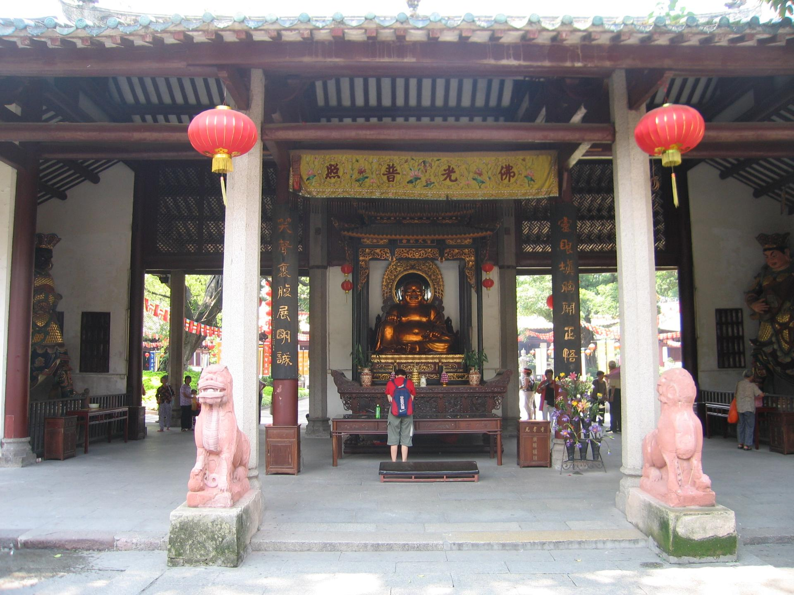

# 光孝寺

## 景点图片

> 图片来源：[Wikimedia Commons](https://commons.wikimedia.org/wiki/File:Guangxiao_Temple.jpg) · 许可证：CC BY-SA 4.0

## 基本信息

| 项目 | 内容 |
|------|------|
| 景点名称 | 光孝寺 |
| 所在城市 | 广州市 |
| 所在区县 | 越秀区 |
| 景点级别 | 全国重点文物保护单位 |
| 景点类型 | 宗教寺庙 |
| 开放时间 | 06:00-17:00 |
| 门票价格 | 5元/人 |

## 景点介绍

光孝寺位于广州市越秀区光孝路，是广州历史最悠久的佛教寺院，始建于三国时期（约公元233年），距今已有1700多年历史。广州有"未有羊城，先有光孝"之说，可见其历史之悠久。光孝寺是全国重点文物保护单位，也是岭南地区最著名的佛教寺院之一。

光孝寺在中国佛教史上具有重要地位。禅宗六祖惠能曾在此剃发出家，寺内保存有瘗发塔，是六祖惠能剃发之处。此外，寺内还有东西铁塔，是中国现存最古老的铁塔。大雄宝殿是寺内最宏伟的建筑，殿内供奉着三尊大佛。

光孝寺占地面积约3万多平方米，建筑布局严谨，古树参天，环境清幽，是广州市民礼佛和游客参观的重要场所。

## 景点特点

- **千年古刹**：始建于三国时期，有1700多年历史
- **六祖惠能剃发处**：禅宗六祖惠能曾在此剃发出家，寺内有瘗发塔
- **东西铁塔**：中国现存最古老的铁塔
- **"未有羊城，先有光孝"**：广州历史最悠久的佛教寺院
- **大雄宝殿**：寺内最宏伟的建筑

## 位置

- **地址**：广州市越秀区光孝路109号
- **经纬度**：23.1289°N, 113.2556°E

## 交通

- **地铁**：1号线西门口站B出口
- **公交**：2路、31路、38路、103路、105路、107路、109路、124路、128路、134路、181路、186路、204路、209路、215路、251路、253路、260路、261路、283路、286路、288路、518路、521路、527路、541路、556路、823路等
- **自驾**：可停放至周边停车场

## 数据来源

- [百度百科-光孝寺](https://baike.baidu.com/item/光孝寺)

## 最后更新时间

2026-06-20
