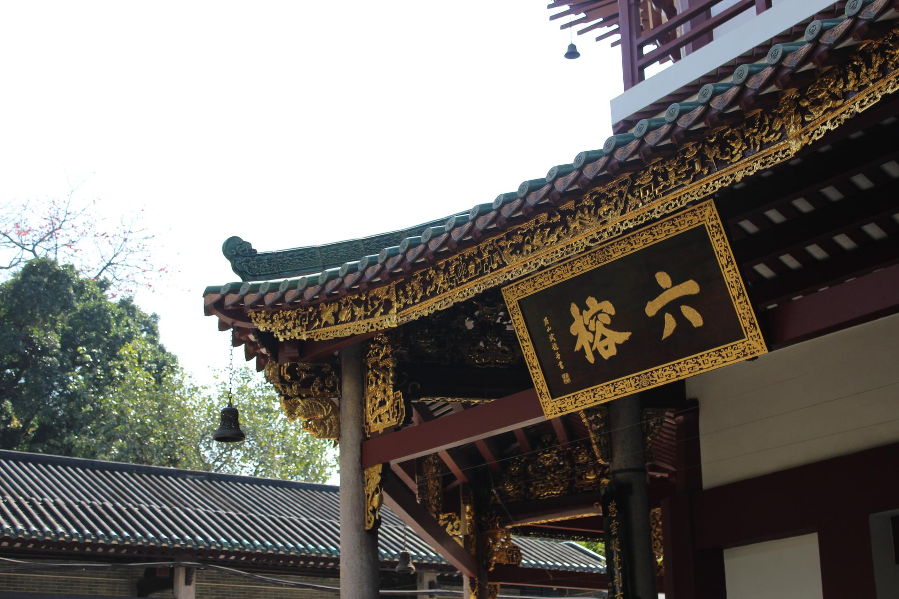
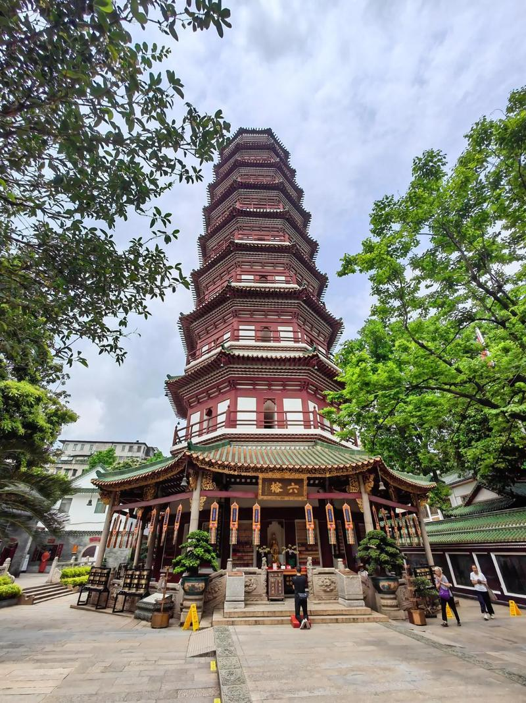

# 六榕寺

## 景点图片

## 基本信息

| 项目 | 内容 |
|------|------|
| 景点名称 | 六榕寺 |
| 所在城市 | 广州市 |
| 所在区县 | 越秀区 |
| 景点级别 | 全国重点文物保护单位 |
| 景点类型 | 宗教寺庙 |
| 开放时间 | 08:00-17:00 |
| 门票价格 | 寺院免费；花塔5元/人 |

## 景点介绍

六榕寺位于广州市越秀区六榕路，是广州著名的佛教寺院，始建于南朝梁大同三年（公元537年），距今已有近1500年的历史。原名"宝庄严寺"，宋代时苏东坡来寺游览，见寺内有六棵古榕树，欣然题写"六榕"二字，后改名为"六榕寺"。

六榕寺最著名的建筑是**花塔**（又称千佛塔），始建于梁大同三年，现存建筑为北宋绍圣四年（1097年）重建。花塔高57米，八角形楼阁式砖塔，外壁色彩斑斓，因此得名"花塔"。花塔是广州的标志性古建筑之一，也是广州市内最高的古建筑。

寺内还有大雄宝殿、观音殿、六祖堂等建筑，以及大量珍贵的佛教文物和碑刻。六榕寺与光孝寺齐名，是广州最重要的佛教寺院之一。

## 景点特点

- **千年古刹**：始建于公元537年，近1500年历史
- **花塔**：高57米，八角形楼阁式砖塔，广州标志性古建筑
- **苏东坡题字**：宋代苏东坡题写"六榕"二字
- **六祖堂**：纪念禅宗六祖惠能
- **佛教文物**：保存大量珍贵的佛教文物和碑刻

## 位置

- **地址**：广州市越秀区六榕路87号
- **经纬度**：23.1278°N, 113.2598°E

## 交通

- **地铁**：1号线/2号线公园前站，步行约10分钟
- **公交**：多路公交可达
- **自驾**：可停放至周边停车场

## 数据来源

- [百度百科-六榕寺](https://baike.baidu.com/item/六榕寺)

## 最后更新时间

2026-06-20
