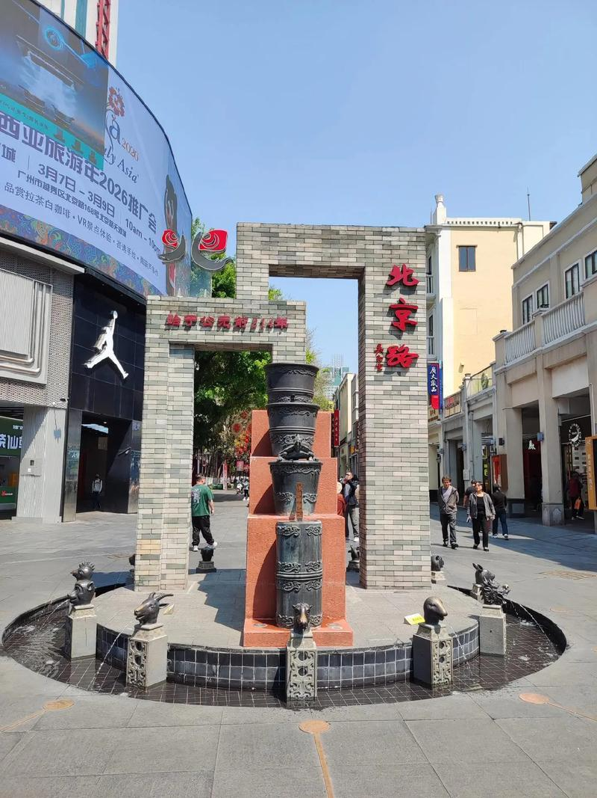

# 北京路步行街

## 景点图片

## 基本信息

| 项目 | 内容 |
|------|------|
| 景点名称 | 北京路步行街 |
| 所在城市 | 广州市 |
| 所在区县 | 越秀区 |
| 景点级别 | 无 |
| 景点类型 | 历史文化商业街区 |
| 开放时间 | 全天开放（商铺营业时间：10:00-22:00） |
| 门票价格 | 免费 |

## 景点介绍

北京路步行街位于广州市越秀区，是广州最著名、最繁华的商业步行街之一，也是广州两千多年城市发展史的缩影。步行街始建于宋代，至今已有上千年的历史，是广州传统的商业中心。

北京路步行街最引人注目的是地下保存的千年古道遗址。在步行街地面的玻璃罩下，清晰展示了从南越国、唐代、宋代、明代到清代等不同朝代的路面遗迹，直观呈现了广州两千多年的城市变迁。这一考古发现在2002年被评为全国十大考古发现之一。

步行街周边还有大佛寺、南越王博物院（王宫展区）、广州起义纪念馆等历史文化景点，以及广百百货、天河城百货等大型商业综合体，是集购物、美食、文化于一体的综合性街区。

## 景点特点

- **千年古道遗址**：地面玻璃罩下展示南越国至清代各朝代路面遗迹
- **全国十大考古发现**：2002年被评为全国十大考古发现之一
- **广州商业中心**：广州最繁华的商业步行街之一
- **历史文化街区**：周边有大佛寺、南越王博物院等历史景点
- **美食天堂**：汇聚广州传统小吃和各类餐饮

## 位置

- **地址**：广州市越秀区北京路
- **经纬度**：23.1267°N, 113.2689°E

## 交通

- **地铁**：1号线/2号线公园前站、6号线北京路站
- **公交**：多路公交可达
- **自驾**：可停放至周边停车场

## 数据来源

- [百度百科-北京路步行街](https://baike.baidu.com/item/北京路步行街)

## 最后更新时间

2026-06-20
