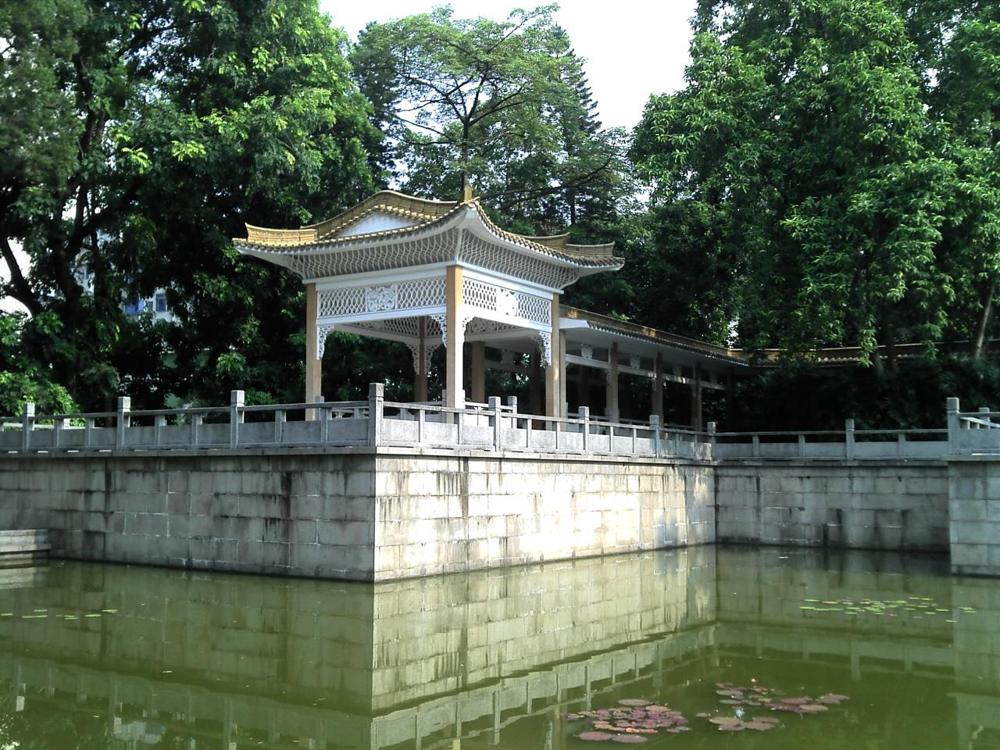

# 广州烈士陵园

## 景点图片

> 图片拍摄于 2012-08-28。来源：[Wikimedia Commons](https://commons.wikimedia.org/wiki/File:Guangzhou_in_china%E5%B9%BF%E5%B7%9E%E7%83%88%E5%A3%AB%E9%99%B5%E5%9B%AD_-_panoramio.jpg) · 作者：peter boy12qq12 · 许可证：[CC BY 3.0](https://creativecommons.org/licenses/by/3.0/)

## 基本信息

| 项目 | 内容 |
|------|------|
| 景点名称 | 广州烈士陵园 |
| 所在城市 | 广州市 |
| 所在区县 | 越秀区 |
| 景点级别 | 4A级景区 |
| 景点类型 | 革命纪念设施、城市公园 |
| 开放时间 | 以景区现场公告为准 |
| 门票价格 | 免费 |

## 景点介绍

广州烈士陵园位于越秀区中山二路，是纪念广州起义烈士的重要纪念场所，也是一座兼具革命历史教育和城市园林功能的公共园区。

## 景点特点

- **革命纪念地**：集中展示广州起义相关历史记忆
- **纪念建筑群**：园内分布纪念碑、陵墓及纪念设施
- **公共园林**：绿化空间与纪念空间相结合

## 位置

- **地址**：广州市越秀区中山二路92号

## 交通

- **地铁**：乘坐广州地铁1号线至烈士陵园站
- **公交**：可乘公交至烈士陵园站或中山医站

## 数据来源

- [广州市文化广电旅游局：广州市A级景区名录](http://wglj.gz.gov.cn/ggfw/lyl/lydwcx/content/post_10878689.html)

## 最后更新时间

2026-07-15
