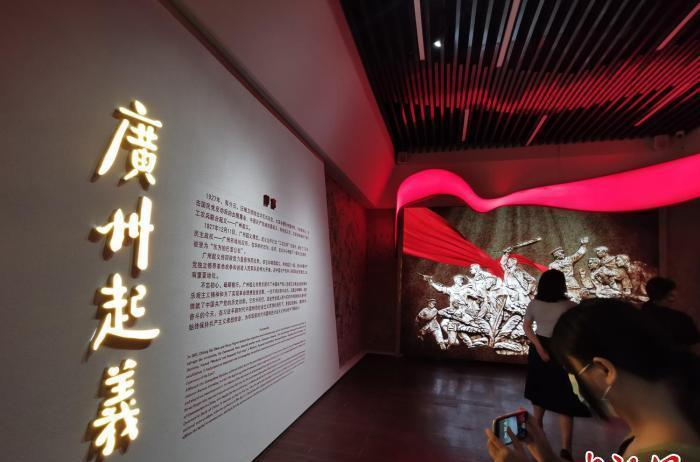

# 广州起义纪念馆

## 景点图片

## 基本信息

| 项目 | 内容 |
|------|------|
| 景点名称 | 广州起义纪念馆 |
| 所在城市 | 广州市 |
| 所在区县 | 越秀区 |
| 景点级别 | 全国重点文物保护单位 |
| 景点类型 | 革命历史遗址/纪念馆 |
| 开放时间 | 09:00-17:00（周一闭馆） |
| 门票价格 | 免费（需预约） |

## 景点介绍

广州起义纪念馆即广州公社旧址，位于广州市越秀区起义路200号之一，是1927年12月11日中国共产党领导的广州起义的指挥部所在地。起义期间，这里曾作为广州苏维埃政府（广州公社）的办公地点。

广州起义是中国共产党领导的三大武装起义之一，是中国革命史上的重要事件。纪念馆内设有广州起义历史陈列馆，展示了起义的历史背景、经过和意义。馆内保存有起义时期的珍贵文物和历史资料。

广州起义纪念馆是全国重点文物保护单位，也是重要的红色旅游景点和爱国主义教育基地。

## 景点特点

- **广州起义指挥部**：1927年广州起义的重要历史遗址
- **全国重点文物保护单位**：重要的历史文化遗产
- **历史陈列馆**：展示起义历史
- **免费开放**：重要的爱国主义教育基地
- **红色旅游**：了解中国革命史的重要窗口

## 位置

- **地址**：广州市越秀区起义路200号之一
- **经纬度**：23.124°N, 113.2643°E

## 交通

- **地铁**：1号线/2号线公园前站
- **公交**：多路公交至起义路站
- **自驾**：可停放至周边停车场

## 数据来源

- [百度百科-广州起义纪念馆](https://baike.baidu.com/item/广州起义纪念馆)

## 最后更新时间

2026-06-20
