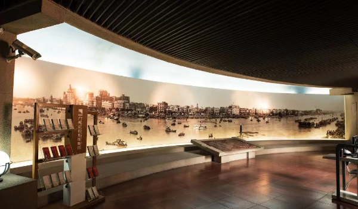

# 广州近代史博物馆

## 景点图片

## 基本信息

| 项目 | 内容 |
|------|------|
| 景点名称 | 广州近代史博物馆 |
| 所在城市 | 广州市 |
| 所在区县 | 越秀区 |
| 景点级别 | 3A级景区 |
| 景点类型 | 历史博物馆 |
| 开放时间 | 周二至周日09:00-17:30，17:00停止入馆；周一闭馆，法定节假日和特殊日期除外 |
| 门票价格 | 免费，现场排队入馆，无需预约 |

## 景点介绍

广州近代史博物馆位于广州起义烈士陵园内，馆舍为1909年建成的广东咨议局旧址。该建筑是广东省第一座具有资产阶级民主议会形式的公共建筑，现为全国重点文物保护单位，由广东革命历史博物馆管理。

博物馆以广州近代历史为主要展示内容，通过文物、历史图片和档案资料呈现广州在中国近代政治、经济、社会及革命进程中的重要地位。官方每天10:00和15:00提供免费讲解，临时调整以博物馆公告为准。

## 景点特点

- **广东咨议局旧址**：保存清末议会建筑及其历史空间
- **全国重点文物保护单位**：兼具建筑遗产与近代史价值
- **近代广州专题展示**：系统呈现城市近代历史变迁
- **免费讲解**：每日10:00和15:00提供公益讲解

## 位置

- **地址**：广州市越秀区陵园西路2号大院之二
- **经纬度**：23.1286°N, 113.2834°E

## 交通

- **地铁**：1号线烈士陵园站D出口，经广州起义烈士陵园前往
- **公交**：乘坐途经烈士陵园站或东风大酒店站的公交线路

## 数据来源

- [广东革命历史博物馆：参观指南](https://www.gemg1959.cn/gdgmls/visitionInfo)
- [越秀区人民政府：广州近代史博物馆](https://www.yuexiu.gov.cn/zjyx/yxjd/gzjdgms/content/post_8663648.html)
- 图片来源：广州市越秀区人民政府

## 最后更新时间

2026-07-14
