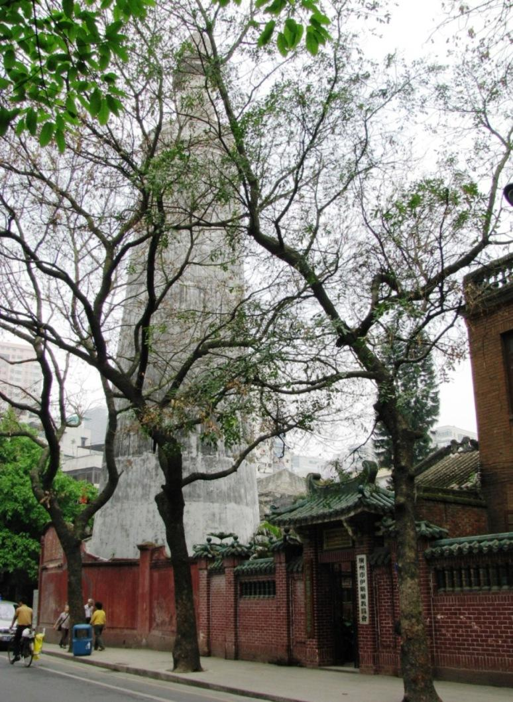

# 怀圣寺

## 景点图片

> 图片来源：[Wikimedia Commons](https://commons.wikimedia.org/wiki/File:Huaisheng_Mosque.jpg) · 许可证：CC BY-SA 4.0

## 基本信息

| 项目 | 内容 |
|------|------|
| 景点名称 | 怀圣寺 |
| 所在城市 | 广州市 |
| 所在区县 | 越秀区 |
| 景点级别 | 全国重点文物保护单位 |
| 景点类型 | 宗教建筑 |
| 开放时间 | 08:00-17:00（非穆斯林礼拜时间可参观） |
| 门票价格 | 免费 |

## 景点介绍

怀圣寺位于广州市越秀区光塔路56号，是中国现存最古老的清真寺之一，也是全国重点文物保护单位。怀圣寺始建于唐代（约627-649年），由来华传教的阿拉伯传教士阿布·宛葛素主持建造，距今已有1300多年历史。

怀圣寺因纪念伊斯兰教先知穆罕默德（圣人）而得名"怀圣"。寺内最著名的建筑是光塔（又称怀圣塔），塔高36.3米，塔身呈圆柱形，青砖砌筑，塔顶原设有导航灯火，是古代珠江航行的灯塔，也是广州作为海上丝绸之路起点的重要见证。

怀圣寺占地面积约3000平方米，主要建筑有看月楼、礼拜殿、光塔等。寺内古木参天，环境清幽，是广州伊斯兰教的重要活动场所。

## 景点特点

- **中国最古老清真寺之一**：始建于唐代，1300多年历史
- **全国重点文物保护单位**：重要的历史文化遗产
- **光塔**：唐代古塔，古代珠江航标
- **海上丝路见证**：广州作为海上丝绸之路起点的重要遗迹
- **阿拉伯建筑风格**：融合中阿建筑特色
- **免费开放**：可入寺参观

## 位置

- **地址**：广州市越秀区光塔路56号
- **经纬度**：23.1194°N, 113.2556°E

## 交通

- **地铁**：1号线西门口站A出口，步行约5分钟
- **公交**：2路、4路、31路等至光塔路站
- **自驾**：可停放至周边停车场

## 数据来源

- [百度百科-怀圣寺](https://baike.baidu.com/item/怀圣寺)

## 最后更新时间

2026-06-25
