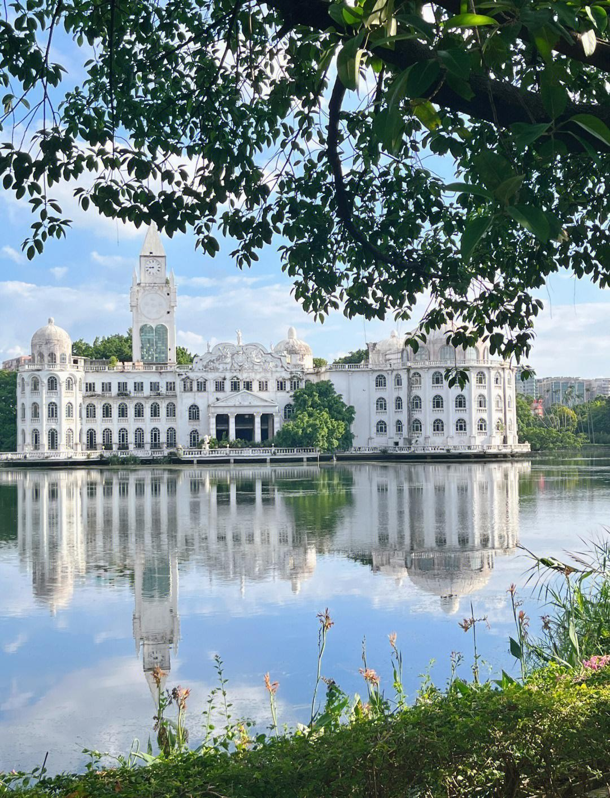

# 流花湖公园

## 景点图片

## 基本信息

| 项目 | 内容 |
|------|------|
| 景点名称 | 流花湖公园 |
| 所在城市 | 广州市 |
| 所在区县 | 越秀区 |
| 景点级别 | - |
| 景点类型 | 综合性公园 |
| 开放时间 | 06:00-22:00 |
| 门票价格 | 免费 |

## 景点介绍

流花湖公园位于广州市越秀区流花路，是广州市区最大的综合性公园之一，占地面积约54万平方米。公园以流花湖为主体，湖水面积约33万平方米，是广州城市中心难得的水景公园。

流花湖公园建于1958年，原为广州市民义务劳动挖建的人工湖。公园内绿树成荫，湖光潋滟，分为西湖、东湖和北湖三个湖区。园内建有落羽杉林、荷塘月色、流花西苑、芙蓉洲等多个特色景区，是广州市民休闲娱乐的重要场所。

流花湖公园还以其观鸟资源而闻名，每年冬季都有大量候鸟在此栖息，是广州市区的观鸟胜地之一。公园内的落羽杉林在秋冬季节变成红褐色，成为广州著名的网红打卡点。

## 景点特点

- **市区最大公园之一**：占地54万平方米，湖水面积33万平方米
- **城市水景公园**：以流花湖为主体，湖光潋滟
- **落羽杉林**：秋冬红叶景观，广州网红打卡点
- **观鸟胜地**：每年冬季大量候鸟栖息
- **休闲娱乐**：广州市民休闲健身的重要场所

## 位置

- **地址**：广州市越秀区流花路100号
- **经纬度**：23.1374°N, 113.2517°E

## 交通

- **地铁**：2号线越秀公园站或纪念堂站，步行约10分钟
- **公交**：5路、7路、21路、24路、42路等多路公交至流花湖公园站
- **自驾**：公园周边有多个停车场

## 数据来源

- [百度百科-流花湖公园](https://baike.baidu.com/item/流花湖公园)

## 最后更新时间

2026-06-28
