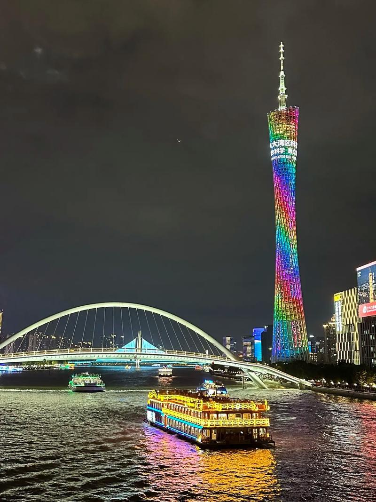

# 珠江夜游

## 景点图片

## 基本信息

| 项目 | 内容 |
|------|------|
| 景点名称 | 珠江夜游 |
| 所在城市 | 广州市 |
| 所在区县 | 越秀区 |
| 景点级别 | 无 |
| 景点类型 | 水上观光 |
| 开放时间 | 18:00-22:00 |
| 门票价格 | 约80-200元/人（视船型） |

## 景点介绍

珠江夜游是广州市最著名的旅游项目之一，游客乘坐游船沿珠江航行，欣赏两岸的壮丽夜景。珠江夜游最热门的登船码头是天字码头，始建于清代，被誉为"广州第一码头"。

珠江夜游全程约60-70分钟，沿途可欣赏到广州塔（小蛮腰）、海心桥、海印大桥、猎德大桥、白鹅潭等著名景点。每到夜晚，珠江两岸的灯光璀璨，倒映在江面上，构成一幅壮观的城市夜景。

珠江夜游是体验广州城市魅力的最佳方式之一，也是广州市民和游客休闲娱乐的热门选择。

## 景点特点

- **广州第一码头**：天字码头，始建于清代
- **壮丽夜景**：珠江两岸灯光璀璨
- **沿途景点**：广州塔、海心桥、海印大桥、猎德大桥、白鹅潭等
- **60-70分钟航程**：体验广州城市魅力
- **多种船型**：普通游船、豪华游船等

## 位置

- **地址**：广州市越秀区沿江中路天字码头
- **经纬度**：23.1167°N, 113.2500°E

## 交通

- **地铁**：2号线海珠广场站
- **公交**：多路公交至天字码头站
- **自驾**：可停放至周边停车场

## 数据来源

- [百度百科-珠江夜游](https://baike.baidu.com/item/珠江夜游)

## 最后更新时间

2026-06-20
